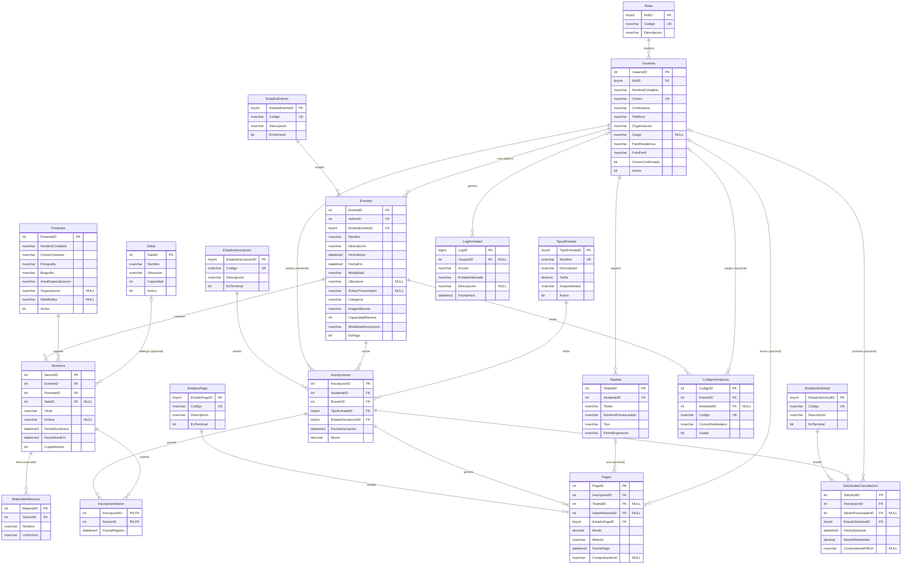

# EVENTCORE — Entidades, campos y mapa de relaciones

> Hoja de trabajo para entender el modelo y maquetar el diagrama ER. **Coincide 1:1 con
> `eventcore_ddl.sql`**: mismos nombres de tabla y columna (PascalCase, plural), mismos tipos,
> mismas FKs. Motor: **SQL Server 2016+**, schema `dbo`.
>
> **19 tablas = 14 de negocio + 5 lookup · 24 llaves foráneas · 1 relación N:M.**

---

## Cómo leer este documento (leyenda)

Estas marcas se usan en TODO el documento, sobre todo en las tablas de campos (§5):

| Marca | Significa | Cómo se ve en el DDL |
|-------|-----------|----------------------|
| **PK** | *Primary Key* — identifica de forma única cada fila. | `CONSTRAINT PK_... PRIMARY KEY (...)` |
| **FK** | *Foreign Key* — apunta al PK de otra tabla (relación). | `CONSTRAINT FK_... FOREIGN KEY (...) REFERENCES ...` |
| **UQ** | *Unique* — no se permite repetir el valor (pero no es la PK). | `CONSTRAINT UQ_... UNIQUE (...)` |
| **CK** | *Check* — regla que el valor debe cumplir (rango, formato, lista). | `CONSTRAINT CK_... CHECK (...)` |
| **IDENTITY** | El motor genera el número solo, autoincremental (1,2,3…). | `IDENTITY(1,1)` |
| **Nulo = Sí** | El campo es *opcional* (puede quedar vacío). | columna `NULL` |
| **Nulo = No** | El campo es *obligatorio*. | columna `NOT NULL` |
| `DEFAULT x` | Si no se manda valor, el motor pone `x`. | `CONSTRAINT DF_... DEFAULT (x)` |

**Tipos de dato (qué guarda y cuánto pesa):**

| Tipo en el DDL | Qué guarda | Tamaño / rango |
|----------------|-----------|----------------|
| `TINYINT` | enteros muy pequeños (IDs de lookup) | 0 a 255 (1 byte) |
| `INT` | enteros normales (IDs de negocio) | ±2,100 millones (4 bytes) |
| `BIGINT` | enteros enormes (la bitácora crece mucho) | gigantesco (8 bytes) |
| `NVARCHAR(n)` | texto Unicode de **hasta `n`** caracteres | `n` = tope; ocupa lo que use |
| `NVARCHAR(MAX)` | texto largo sin tope práctico (biografías, descripciones) | hasta ~1 GB |
| `DECIMAL(10,2)` | dinero exacto: 10 dígitos, 2 decimales | hasta 99,999,999.99 |
| `DATETIME2(0)` | fecha + hora, **sin** fracciones de segundo | precisión = segundos |
| `BIT` | booleano (sí/no, 1/0) | 1 bit |

> **Regla de oro de las FK:** en una relación *uno a muchos*, la columna FK **siempre vive en el
> lado “muchos”**. Ej.: un evento tiene muchas sesiones → `Sesiones` lleva `EventoID`, no al revés.

---

## 0. Las 19 entidades, agrupadas

Las **lookup** son la forma normalizada de los enums de *estado/rol* (en vez de `CHECK IN(...)`):
son extensibles y traen `EsTerminal` para marcar estados cerrados. Los enums **fijos** (modalidad,
categoría, método de pago, tipo de tarjeta) **no** son tablas: quedaron como `CHECK` dentro de su
columna porque no cambian con el tiempo.

| Grupo | Tablas | ¿Tiene FK que sale? |
|-------|--------|:--:|
| **Lookup** (catálogos de estado/rol) | `Roles`, `EstadosEvento`, `EstadosInscripcion`, `EstadosPago`, `EstadosSolicitud` | No (son “hojas” de entrada) |
| **Catálogos base** | `Usuarios`, `Ponentes`, `Salas`, `TiposEntrada` | Solo `Usuarios` → `Roles` |
| **Núcleo del evento** | `Eventos`, `Sesiones`, `MaterialesRecurso` | Sí |
| **Inscripciones** | `Inscripciones`, `InscripcionSesion`, `CodigosInvitacion` | Sí |
| **Pagos / cancelaciones** | `Tarjetas`, `Pagos`, `SolicitudesCancelacion` | Sí |
| **Bitácora** | `LogActividad` | Sí (a `Usuarios`) |

> Para empezar a dibujar, arranca por las cajas que **no dependen de nadie**: las 5 lookup +
> `Ponentes`, `Salas`, `TiposEntrada`. Desde ahí van saliendo las flechas hacia el resto.

---

## 0.1 Diagrama ER (vista rápida)

Diagrama en **Mermaid**: se ve gráfico en VS Code (extensión Markdown Preview Mermaid), GitHub,
Obsidian o <https://mermaid.live>. Marcas: `PK` primaria · `FK` foránea · `UK` único.
Líneas: `||──o{` = uno a muchos (obligatorio) · `|o──o{` = uno a muchos (FK **opcional**).
Los tamaños exactos de cada tipo están en §4; aquí se omiten para que el diagrama sea legible.

> **Cómo leer las líneas:** el extremo `||` (una barrita doble) es el lado “uno”; el extremo `o{`
> (círculo + pata de gallo) es el lado “muchos”. Un círculo `o` cerca de una caja = participación
> **opcional** (cero permitido). La N:M `Inscripciones ↔ Sesiones` aparece como dos relaciones
> 1─N que entran a la caja puente `InscripcionSesion`.

---

## 1. Mapa de foráneas — el corazón del modelo

Cada fila es **una FK**: *“la columna de la tabla **hijo** apunta al PK de la tabla **padre**”*.
La FK siempre vive en el hijo (lado “muchos”).

### FKs de negocio (19)

| # | Tabla hijo (lleva la FK) | Columna FK | → Tabla padre | → PK padre | ¿Opcional? | Borrado | Para qué sirve |
|--:|--------------------------|------------|---------------|-----------|:--:|--------|----------------|
| 1 | `Eventos` | `AdminID` | `Usuarios` | `UsuarioID` | No | — | admin que crea el evento |
| 2 | `Sesiones` | `EventoID` | `Eventos` | `EventoID` | No | — | a qué evento pertenece |
| 3 | `Sesiones` | `PonenteID` | `Ponentes` | `PonenteID` | No | — | quién imparte |
| 4 | `Sesiones` | `SalaID` | `Salas` | `SalaID` | **Sí** | — | NULL si es virtual (enlace) |
| 5 | `MaterialesRecurso` | `SesionID` | `Sesiones` | `SesionID` | No | **CASCADE** | si borras la sesión, se borran sus materiales |
| 6 | `Inscripciones` | `AsistenteID` | `Usuarios` | `UsuarioID` | No | — | quién se inscribe |
| 7 | `Inscripciones` | `EventoID` | `Eventos` | `EventoID` | No | — | a qué evento |
| 8 | `Inscripciones` | `TipoEntradaID` | `TiposEntrada` | `TipoEntradaID` | No | — | qué tarifa eligió |
| 9 | `InscripcionSesion` | `InscripcionID` | `Inscripciones` | `InscripcionID` | No | — | parte de la PK compuesta |
| 10 | `InscripcionSesion` | `SesionID` | `Sesiones` | `SesionID` | No | — | parte de la PK compuesta |
| 11 | `CodigosInvitacion` | `EventoID` | `Eventos` | `EventoID` | No | — | invitación a qué evento |
| 12 | `CodigosInvitacion` | `AsistenteID` | `Usuarios` | `UsuarioID` | **Sí** | — | NULL hasta que se canjea |
| 13 | `Tarjetas` | `AsistenteID` | `Usuarios` | `UsuarioID` | No | — | dueño de la tarjeta |
| 14 | `Pagos` | `InscripcionID` | `Inscripciones` | `InscripcionID` | No | — | qué inscripción se paga |
| 15 | `Pagos` | `TarjetaID` | `Tarjetas` | `TarjetaID` | **Sí** | — | NULL si fue transferencia |
| 16 | `Pagos` | `AdminRevisorID` | `Usuarios` | `UsuarioID` | **Sí** | — | admin que revisa transferencia |
| 17 | `SolicitudesCancelacion` | `InscripcionID` | `Inscripciones` | `InscripcionID` | No | — | qué inscripción se cancela |
| 18 | `SolicitudesCancelacion` | `AdminProcesadorID` | `Usuarios` | `UsuarioID` | **Sí** | — | admin que procesa reembolso |
| 19 | `LogActividad` | `UsuarioID` | `Usuarios` | `UsuarioID` | **Sí** | — | NULL si la acción es del sistema |

### FKs hacia las lookup (5)

| # | Tabla hijo | Columna FK | → Tabla lookup | → PK padre | ¿Opcional? | Default |
|--:|------------|------------|----------------|-----------|:--:|---------|
| 20 | `Usuarios` | `RolID` | `Roles` | `RolID` | No | — |
| 21 | `Eventos` | `EstadoEventoID` | `EstadosEvento` | `EstadoEventoID` | No | `1` = BORRADOR |
| 22 | `Inscripciones` | `EstadoInscripcionID` | `EstadosInscripcion` | `EstadoInscripcionID` | No | `1` = PENDIENTE |
| 23 | `Pagos` | `EstadoPagoID` | `EstadosPago` | `EstadoPagoID` | No | `1` = PENDIENTE |
| 24 | `SolicitudesCancelacion` | `EstadoSolicitudID` | `EstadosSolicitud` | `EstadoSolicitudID` | No | `1` = PENDIENTE |

**Total: 24 llaves foráneas.**

> `Usuarios` es la tabla más “apuntada”: recibe **7 FKs** de negocio (#1, 6, 12, 13, 16, 18, 19).
> Cada lookup recibe solo 1. En el diagrama, dibuja las lookup como cajitas pequeñas al borde.

---

## 2. Las flechas — quién apunta a quién

**Flechas que SALEN** (a quién apunta cada tabla):

- **`Usuarios`** → `Roles`
- **`Eventos`** → `Usuarios` (admin), `EstadosEvento`
- **`Sesiones`** → `Eventos`, `Ponentes`, `Salas` *(opcional)*
- **`MaterialesRecurso`** → `Sesiones` *(cascada)*
- **`Inscripciones`** → `Usuarios` (asistente), `Eventos`, `TiposEntrada`, `EstadosInscripcion`
- **`InscripcionSesion`** → `Inscripciones`, `Sesiones`  *(puente N:M)*
- **`CodigosInvitacion`** → `Eventos`, `Usuarios` (asistente, opcional)
- **`Tarjetas`** → `Usuarios` (asistente)
- **`Pagos`** → `Inscripciones`, `Tarjetas` *(op.)*, `Usuarios` (revisor, op.), `EstadosPago`
- **`SolicitudesCancelacion`** → `Inscripciones`, `Usuarios` (procesador, op.), `EstadosSolicitud`
- **`LogActividad`** → `Usuarios` *(opcional)*

**Flechas que ENTRAN** (cuántas FK recibe cada tabla):

| Tabla padre | Recibe FK desde | Total |
|-------------|-----------------|:--:|
| `Usuarios` | Eventos, Inscripciones, CodigosInvitacion, Tarjetas, Pagos, SolicitudesCancelacion, LogActividad | **7** |
| `Eventos` | Sesiones, Inscripciones, CodigosInvitacion | **3** |
| `Inscripciones` | InscripcionSesion, Pagos, SolicitudesCancelacion | **3** |
| `Sesiones` | MaterialesRecurso, InscripcionSesion | **2** |
| `TiposEntrada` · `Ponentes` · `Salas` · `Tarjetas` | (una cada una) | **1** c/u |
| `Roles` · `EstadosEvento` · `EstadosInscripcion` · `EstadosPago` · `EstadosSolicitud` | (una cada una) | **1** c/u |
| `MaterialesRecurso`, `InscripcionSesion`, `CodigosInvitacion`, `LogActividad` | nadie | **0** (hojas) |

---

## 3. Cardinalidades (para rotular cada relación)

`1 ──< N` = uno a muchos (el lado **N** lleva la FK). Las lookup son siempre el lado “1”.
`0..1 ──< N` = igual, pero la FK es opcional (línea punteada en el diagrama).

| Relación (se lee: padre → hijo) | Cardinalidad | La FK vive en |
|---------------------------------|:--:|----------------|
| `Roles` clasifica `Usuarios` | 1 ──< N | `Usuarios.RolID` |
| `Usuarios`(admin) crea `Eventos` | 1 ──< N | `Eventos.AdminID` |
| `EstadosEvento` clasifica `Eventos` | 1 ──< N | `Eventos.EstadoEventoID` |
| `Eventos` contiene `Sesiones` | 1 ──< N | `Sesiones.EventoID` |
| `Ponentes` imparte `Sesiones` | 1 ──< N | `Sesiones.PonenteID` |
| `Salas` alberga `Sesiones` | 0..1 ──< N | `Sesiones.SalaID` (opcional) |
| `Sesiones` tiene `MaterialesRecurso` | 1 ──< N | `MaterialesRecurso.SesionID` |
| `Usuarios`(asistente) realiza `Inscripciones` | 1 ──< N | `Inscripciones.AsistenteID` |
| `Eventos` recibe `Inscripciones` | 1 ──< N | `Inscripciones.EventoID` |
| `TiposEntrada` clasifica `Inscripciones` | 1 ──< N | `Inscripciones.TipoEntradaID` |
| `EstadosInscripcion` clasifica `Inscripciones` | 1 ──< N | `Inscripciones.EstadoInscripcionID` |
| `Eventos` emite `CodigosInvitacion` | 1 ──< N | `CodigosInvitacion.EventoID` |
| `Usuarios` canjea `CodigosInvitacion` | 0..1 ──< N | `CodigosInvitacion.AsistenteID` |
| `Usuarios` registra `Tarjetas` | 1 ──< N | `Tarjetas.AsistenteID` |
| `Inscripciones` genera `Pagos` | 1 ──< N | `Pagos.InscripcionID` |
| `Tarjetas` se usa en `Pagos` | 0..1 ──< N | `Pagos.TarjetaID` (opcional) |
| `Usuarios`(revisor) revisa `Pagos` | 0..1 ──< N | `Pagos.AdminRevisorID` (opcional) |
| `EstadosPago` clasifica `Pagos` | 1 ──< N | `Pagos.EstadoPagoID` |
| `Inscripciones` tiene `SolicitudesCancelacion` | 1 ──< N | `SolicitudesCancelacion.InscripcionID` |
| `Usuarios`(procesador) procesa `SolicitudesCancelacion` | 0..1 ──< N | `SolicitudesCancelacion.AdminProcesadorID` (op.) |
| `EstadosSolicitud` clasifica `SolicitudesCancelacion` | 1 ──< N | `SolicitudesCancelacion.EstadoSolicitudID` |
| `Usuarios` genera `LogActividad` | 0..1 ──< N | `LogActividad.UsuarioID` (opcional) |
| **`Inscripciones` ↔ `Sesiones`** | **N : M** | resuelta con `InscripcionSesion` |

> **La única N:M:** un asistente (vía su inscripción) entra a varias sesiones, y una sesión recibe
> varias inscripciones → se rompe con la tabla puente `InscripcionSesion`, que tiene **PK compuesta**
> (`InscripcionID` + `SesionID`). Esa PK doble, además de identificar, **impide registrar dos veces
> la misma sesión en una inscripción**.

---

## 4. Campos por tabla (con tipo, tamaño y claves)

> Columnas de cada tabla: **Campo · Tipo(tamaño) · ¿Nulo? · Clave · Refiere a / Regla · Notas**.
> La columna **Clave** usa la leyenda de arriba (PK / FK / UQ / CK).

### 4.1 Lookup — PK explícita (no IDENTITY: los IDs se siembran a mano y son estables)

**`Roles`**  ·  *catálogo de roles de usuario*

| Campo | Tipo | Nulo | Clave | Refiere a / Regla | Notas |
|-------|------|:--:|-------|-------------------|-------|
| `RolID` | TINYINT | No | **PK** | — | se siembra 1, 2… |
| `Codigo` | NVARCHAR(20) | No | **UQ** | — | `ADMIN`, `ASISTENTE` |
| `Descripcion` | NVARCHAR(100) | Sí | — | — | texto legible |

> Semilla: `1 ADMIN`, `2 ASISTENTE`.

**`EstadosEvento` · `EstadosInscripcion` · `EstadosPago` · `EstadosSolicitud`** — las cuatro tienen
**la misma estructura** (solo cambia el nombre del PK):

| Campo | Tipo | Nulo | Clave | Refiere a / Regla | Notas |
|-------|------|:--:|-------|-------------------|-------|
| `Estado…ID` | TINYINT | No | **PK** | — | `EstadoEventoID`, `EstadoInscripcionID`, etc. |
| `Codigo` | NVARCHAR(20) | No | **UQ** | — | `PENDIENTE`, `CONFIRMADO`… |
| `Descripcion` | NVARCHAR(100) | Sí | — | — | texto legible |
| `EsTerminal` | BIT | No | — | DEFAULT `0` | `1` = estado cerrado (sin más transiciones) |

> Semillas (`*` = terminal):
> - **EstadosEvento:** 1 BORRADOR · 2 PUBLICADO · 3 CANCELADO* · 4 FINALIZADO*
> - **EstadosInscripcion:** 1 PENDIENTE · 2 APROBADA · 3 RECHAZADA* · 4 CONFIRMADA · 5 CANCELADA*
> - **EstadosPago:** 1 PENDIENTE · 2 CONFIRMADO* · 3 RECHAZADO*
> - **EstadosSolicitud:** 1 PENDIENTE · 2 PROCESADA* · 3 RECHAZADA*

### 4.2 Catálogos base

**`Usuarios`**  ·  *administrador y asistente son la MISMA tabla, los distingue `RolID`*

| Campo | Tipo | Nulo | Clave | Refiere a / Regla | Notas |
|-------|------|:--:|-------|-------------------|-------|
| `UsuarioID` | INT IDENTITY | No | **PK** | — | autonumérico |
| `NombreCompleto` | NVARCHAR(150) | No | — | — | |
| `Correo` | NVARCHAR(150) | No | **UQ** + **CK** | formato `%_@_%._%` | identifica al usuario, no se repite |
| `Contrasena` | NVARCHAR(255) | No | — | — | **hash**, nunca texto plano |
| `Telefono` | NVARCHAR(30) | No | — | — | |
| `Organizacion` | NVARCHAR(150) | No | — | — | |
| `Cargo` | NVARCHAR(100) | **Sí** | — | — | opcional según enunciado |
| `PaisResidencia` | NVARCHAR(100) | No | — | — | |
| `FotoPerfil` | NVARCHAR(300) | No | — | — | URL/ruta |
| `RolID` | TINYINT | No | **FK** | → `Roles` | ADMIN o ASISTENTE |
| `CorreoConfirmado` | BIT | No | — | DEFAULT `0` | doble opt-in |
| `Activo` | BIT | No | — | DEFAULT `1` | borrado lógico (§14) |

**`Ponentes`**

| Campo | Tipo | Nulo | Clave | Refiere a / Regla | Notas |
|-------|------|:--:|-------|-------------------|-------|
| `PonenteID` | INT IDENTITY | No | **PK** | — | |
| `NombreCompleto` | NVARCHAR(150) | No | — | — | |
| `CorreoContacto` | NVARCHAR(150) | No | **CK** | formato `%_@_%._%` | |
| `Fotografia` | NVARCHAR(300) | No | — | — | |
| `Biografia` | NVARCHAR(MAX) | No | — | — | texto largo |
| `AreaEspecializacion` | NVARCHAR(150) | No | — | — | |
| `Organizacion` | NVARCHAR(150) | **Sí** | — | — | opcional |
| `WebRedes` | NVARCHAR(300) | **Sí** | — | — | opcional |
| `Activo` | BIT | No | — | DEFAULT `1` | “desactivar, no eliminar” |

**`Salas`**

| Campo | Tipo | Nulo | Clave | Refiere a / Regla | Notas |
|-------|------|:--:|-------|-------------------|-------|
| `SalaID` | INT IDENTITY | No | **PK** | — | |
| `Nombre` | NVARCHAR(100) | No | — | — | |
| `Ubicacion` | NVARCHAR(200) | No | — | — | |
| `Capacidad` | INT | No | **CK** | `> 0` | usada en el reporte de ocupación |
| `Activo` | BIT | No | — | DEFAULT `1` | borrado lógico |

**`TiposEntrada`**

| Campo | Tipo | Nulo | Clave | Refiere a / Regla | Notas |
|-------|------|:--:|-------|-------------------|-------|
| `TipoEntradaID` | TINYINT IDENTITY | No | **PK** | — | |
| `Nombre` | NVARCHAR(50) | No | **UQ** | — | EARLY_BIRD, GENERAL, VIP… |
| `Descripcion` | NVARCHAR(300) | No | — | — | |
| `Tarifa` | DECIMAL(10,2) | No | **CK** | `>= 0` | precio |
| `Disponibilidad` | NVARCHAR(200) | No | — | — | regla: “20% del cupo”, “máx 10”… |
| `Activo` | BIT | No | — | DEFAULT `1` | borrado lógico |

### 4.3 Núcleo del evento

**`Eventos`**

| Campo | Tipo | Nulo | Clave | Refiere a / Regla | Notas |
|-------|------|:--:|-------|-------------------|-------|
| `EventoID` | INT IDENTITY | No | **PK** | — | |
| `AdminID` | INT | No | **FK** | → `Usuarios` | admin (rol ADMIN) que lo crea |
| `Nombre` | NVARCHAR(200) | No | — | — | |
| `Descripcion` | NVARCHAR(MAX) | No | — | — | texto largo |
| `FechaInicio` | DATETIME2(0) | No | — | — | |
| `FechaFin` | DATETIME2(0) | No | **CK** | `FechaFin >= FechaInicio` | |
| `Modalidad` | NVARCHAR(15) | No | **CK** | `PRESENCIAL` \| `VIRTUAL` \| `HIBRIDA` | enum fijo |
| `Ubicacion` | NVARCHAR(300) | **Sí** | — | — | física, según modalidad |
| `EnlaceTransmision` | NVARCHAR(300) | **Sí** | — | — | según modalidad |
| `Categoria` | NVARCHAR(15) | No | **CK** | `ACADEMICO`\|`CORPORATIVO`\|`CULTURAL`\|`TECNOLOGICO`\|`OTRO` | enum fijo |
| `ImagenBanner` | NVARCHAR(300) | No | — | — | |
| `CapacidadMaxima` | INT | No | **CK** | `> 0` | |
| `EstadoEventoID` | TINYINT | No | **FK** | → `EstadosEvento` | DEFAULT `1` = BORRADOR |
| `ModalidadInscripcion` | NVARCHAR(15) | No | **CK** | `ABIERTA`\|`APROBACION`\|`INVITACION` | enum fijo |
| `EsPago` | BIT | No | — | DEFAULT `0` | ¿el evento cobra? |

**`Sesiones`**

| Campo | Tipo | Nulo | Clave | Refiere a / Regla | Notas |
|-------|------|:--:|-------|-------------------|-------|
| `SesionID` | INT IDENTITY | No | **PK** | — | |
| `EventoID` | INT | No | **FK** | → `Eventos` | |
| `PonenteID` | INT | No | **FK** | → `Ponentes` | |
| `SalaID` | INT | **Sí** | **FK** | → `Salas` | NULL si la sesión es virtual |
| `Titulo` | NVARCHAR(200) | No | — | — | |
| `Enlace` | NVARCHAR(300) | **Sí** | — | — | “sala o enlace asignado” |
| `FechaHoraInicio` | DATETIME2(0) | No | — | — | |
| `FechaHoraFin` | DATETIME2(0) | No | **CK** | `Fin >= Inicio` | |
| `CupoMaximo` | INT | No | **CK** | `> 0` | |

**`MaterialesRecurso`**  ·  *entidad débil: existe solo mientras exista su sesión*

| Campo | Tipo | Nulo | Clave | Refiere a / Regla | Notas |
|-------|------|:--:|-------|-------------------|-------|
| `MaterialID` | INT IDENTITY | No | **PK** | — | |
| `SesionID` | INT | No | **FK** | → `Sesiones` **ON DELETE CASCADE** | si borras la sesión, se borran sus materiales |
| `Nombre` | NVARCHAR(200) | No | — | — | |
| `UrlArchivo` | NVARCHAR(300) | No | — | — | |

### 4.4 Inscripciones

**`Inscripciones`**

| Campo | Tipo | Nulo | Clave | Refiere a / Regla | Notas |
|-------|------|:--:|-------|-------------------|-------|
| `InscripcionID` | INT IDENTITY | No | **PK** | — | |
| `AsistenteID` | INT | No | **FK** | → `Usuarios` | rol ASISTENTE |
| `EventoID` | INT | No | **FK** | → `Eventos` | |
| `TipoEntradaID` | TINYINT | No | **FK** | → `TiposEntrada` | tarifa elegida |
| `FechaInscripcion` | DATETIME2(0) | No | — | DEFAULT `SYSUTCDATETIME()` | |
| `EstadoInscripcionID` | TINYINT | No | **FK** | → `EstadosInscripcion` | DEFAULT `1` = PENDIENTE |
| `Monto` | DECIMAL(10,2) | No | **CK** | `>= 0`, DEFAULT `0` | base de ingresos y reembolso |

**`InscripcionSesion`**  ·  *tabla puente de la N:M — **PK compuesta**, sin id propio*

| Campo | Tipo | Nulo | Clave | Refiere a / Regla | Notas |
|-------|------|:--:|-------|-------------------|-------|
| `InscripcionID` | INT | No | **PK + FK** | → `Inscripciones` | mitad de la PK |
| `SesionID` | INT | No | **PK + FK** | → `Sesiones` | otra mitad de la PK |
| `FechaRegistro` | DATETIME2(0) | No | — | DEFAULT `SYSUTCDATETIME()` | |

> PK = (`InscripcionID`, `SesionID`) juntas → no se repite el par.

**`CodigosInvitacion`**

| Campo | Tipo | Nulo | Clave | Refiere a / Regla | Notas |
|-------|------|:--:|-------|-------------------|-------|
| `CodigoID` | INT IDENTITY | No | **PK** | — | |
| `EventoID` | INT | No | **FK** | → `Eventos` | |
| `AsistenteID` | INT | **Sí** | **FK** | → `Usuarios` | NULL hasta que se canjea |
| `Codigo` | NVARCHAR(50) | No | **UQ** | — | el código en sí |
| `CorreoDestinatario` | NVARCHAR(150) | No | — | — | a quién se envió |
| `Usado` | BIT | No | — | DEFAULT `0` | |

### 4.5 Pagos y cancelaciones

**`Tarjetas`**

| Campo | Tipo | Nulo | Clave | Refiere a / Regla | Notas |
|-------|------|:--:|-------|-------------------|-------|
| `TarjetaID` | INT IDENTITY | No | **PK** | — | |
| `AsistenteID` | INT | No | **FK** | → `Usuarios` | dueño |
| `Titular` | NVARCHAR(150) | No | — | — | |
| `NumeroEnmascarado` | NVARCHAR(25) | No | — | — | solo últimos dígitos, **nunca** el número completo |
| `Tipo` | NVARCHAR(10) | No | **CK** | `DEBITO` \| `CREDITO` | enum fijo |
| `FechaExpiracion` | NVARCHAR(7) | No | — | formato `MM/AAAA` | |

**`Pagos`**

| Campo | Tipo | Nulo | Clave | Refiere a / Regla | Notas |
|-------|------|:--:|-------|-------------------|-------|
| `PagoID` | INT IDENTITY | No | **PK** | — | |
| `InscripcionID` | INT | No | **FK** | → `Inscripciones` | qué se paga |
| `TarjetaID` | INT | **Sí** | **FK** | → `Tarjetas` | NULL si transferencia |
| `AdminRevisorID` | INT | **Sí** | **FK** | → `Usuarios` | admin que revisa transferencia |
| `Monto` | DECIMAL(10,2) | No | **CK** | `>= 0` | |
| `Metodo` | NVARCHAR(15) | No | **CK** | `TARJETA` \| `TRANSFERENCIA` | enum fijo |
| `EstadoPagoID` | TINYINT | No | **FK** | → `EstadosPago` | DEFAULT `1` = PENDIENTE |
| `FechaPago` | DATETIME2(0) | No | — | DEFAULT `SYSUTCDATETIME()` | base del reporte de ingresos |
| `ComprobanteUrl` | NVARCHAR(300) | **Sí** | — | — | comprobante de transferencia |

**`SolicitudesCancelacion`**

| Campo | Tipo | Nulo | Clave | Refiere a / Regla | Notas |
|-------|------|:--:|-------|-------------------|-------|
| `SolicitudID` | INT IDENTITY | No | **PK** | — | |
| `InscripcionID` | INT | No | **FK** | → `Inscripciones` | |
| `AdminProcesadorID` | INT | **Sí** | **FK** | → `Usuarios` | NULL hasta procesarse |
| `FechaSolicitud` | DATETIME2(0) | No | — | DEFAULT `SYSUTCDATETIME()` | |
| `EstadoSolicitudID` | TINYINT | No | **FK** | → `EstadosSolicitud` | DEFAULT `1` = PENDIENTE |
| `MontoReembolso` | DECIMAL(10,2) | No | **CK** | `>= 0`, DEFAULT `0` | 80% del monto pagado |
| `ComprobantePdfUrl` | NVARCHAR(300) | **Sí** | — | — | PDF que el admin envía |

### 4.6 Bitácora

**`LogActividad`**

| Campo | Tipo | Nulo | Clave | Refiere a / Regla | Notas |
|-------|------|:--:|-------|-------------------|-------|
| `LogID` | BIGINT IDENTITY | No | **PK** | — | crece mucho → BIGINT |
| `UsuarioID` | INT | **Sí** | **FK** | → `Usuarios` | NULL si la acción es del sistema |
| `Accion` | NVARCHAR(50) | No | — | — | CREAR, ACTUALIZAR… |
| `EntidadAfectada` | NVARCHAR(50) | No | — | — | qué tabla/registro |
| `Descripcion` | NVARCHAR(500) | **Sí** | — | — | detalle opcional |
| `FechaHora` | DATETIME2(0) | No | — | DEFAULT `SYSUTCDATETIME()` | |

---

## 5. Orden de creación (sin romper FKs)

Una tabla no puede tener FK a otra que aún no existe. Este es el orden seguro (= orden del `.sql`):

1. **Lookup:** `Roles`, `EstadosEvento`, `EstadosInscripcion`, `EstadosPago`, `EstadosSolicitud`
2. **Catálogos base:** `Usuarios` (→ `Roles`), `Ponentes`, `Salas`, `TiposEntrada`
3. `Eventos` (→ `Usuarios`, `EstadosEvento`)
4. `Sesiones` (→ `Eventos`, `Ponentes`, `Salas`)
5. `MaterialesRecurso` (→ `Sesiones`)
6. `Inscripciones` (→ `Usuarios`, `Eventos`, `TiposEntrada`, `EstadosInscripcion`)
7. `Tarjetas` (→ `Usuarios`), `CodigosInvitacion` (→ `Eventos`, `Usuarios`)
8. `InscripcionSesion` (→ `Inscripciones`, `Sesiones`)
9. `Pagos` (→ `Inscripciones`, `Tarjetas`, `Usuarios`, `EstadosPago`)
10. `SolicitudesCancelacion` (→ `Inscripciones`, `Usuarios`, `EstadosSolicitud`)
11. `LogActividad` (→ `Usuarios`)

---

## 6. Notas para no equivocarse al maquetar

- **`Usuarios` es UNA sola tabla.** El rol lo da `RolID → Roles`. Por eso unas FK se llaman
  `AdminID`, otras `AsistenteID` / `AdminRevisorID` / `AdminProcesadorID`, pero **todas apuntan a
  `Usuarios.UsuarioID`**. No dibujes tablas separadas para admin y asistente.
- **FK opcionales = línea punteada / “0..1”:** `Sesiones.SalaID`, `CodigosInvitacion.AsistenteID`,
  `Pagos.TarjetaID`, `Pagos.AdminRevisorID`, `SolicitudesCancelacion.AdminProcesadorID`,
  `LogActividad.UsuarioID`.
- **Lookup vs CHECK:** los *estados/rol* van en tabla lookup (FK), porque pueden crecer. Los enums
  *fijos* (`Modalidad`, `Categoria`, `ModalidadInscripcion`, `Pagos.Metodo`, `Tarjetas.Tipo`) son
  `CHECK` dentro de la columna → **no son entidades**, no se dibujan como cajas.
- **`InscripcionSesion` no tiene id propio:** su PK es la pareja (`InscripcionID`, `SesionID`). Eso
  resuelve la N:M y de paso evita inscribir dos veces la misma sesión.
- **`MaterialesRecurso` cae en cascada:** borrar una sesión borra sus materiales (es lo único con
  `ON DELETE CASCADE`).
- **No hay tabla de notificaciones:** en el enunciado todo es “notificación por correo”.
- **Reglas de negocio** (traslapes de horario, cupos, Early Bird 20%, VIP máx 10, ventanas 24h/48h,
  reembolso 80%) **no son entidades ni columnas**: van en la lógica/validaciones del backend.
