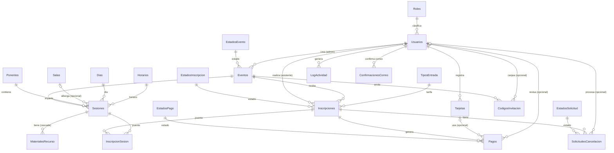

# EVENTCORE — Relaciones (foráneas, cardinalidades y diagrama ER)

> Cómo se conectan las **22 tablas**: **27 llaves foráneas** y **1 relación N:M**.
> Coincide 1:1 con los scripts de `sql/`. El detalle de campos/tipos está en `eventcore-tablas.md`.

---

## Cómo leer las relaciones (leyenda)

- **FK** (*Foreign Key*): columna de la tabla **hijo** que apunta al **PK** de la tabla **padre**.
- **Regla de oro:** en una relación *uno a muchos*, la FK **siempre vive en el lado “muchos”** (hijo).
  Ej.: un evento tiene muchas sesiones → `Sesiones` lleva `EventoID`, no al revés.
- **Cardinalidad:**
  - `1 ──< N` = uno a muchos (la FK es obligatoria).
  - `0..1 ──< N` = uno a muchos, pero la FK es **opcional** (NULL permitido → línea punteada).
  - `N : M` = muchos a muchos → se resuelve con una **tabla puente**.

---

## 1. Mapa de foráneas

Cada fila es **una FK**: *“la columna del **hijo** apunta al PK del **padre**”*.

### FKs de negocio (20)

| # | Tabla hijo (lleva la FK) | Columna FK | → Tabla padre | → PK padre | ¿Opcional? | Borrado | Para qué sirve |
|--:|--------------------------|------------|---------------|-----------|:--:|--------|----------------|
| 1 | `Eventos` | `AdminID` | `Usuarios` | `UsuarioID` | No | — | admin que crea el evento |
| 2 | `Sesiones` | `EventoID` | `Eventos` | `EventoID` | No | — | a qué evento pertenece |
| 3 | `Sesiones` | `PonenteID` | `Ponentes` | `PonenteID` | No | — | quién imparte |
| 4 | `Sesiones` | `SalaID` | `Salas` | `SalaID` | **Sí** | — | NULL si es virtual (enlace) |
| 5 | `MaterialesRecurso` | `SesionID` | `Sesiones` | `SesionID` | No | **CASCADE** | si borras la sesión, se borran sus materiales |
| 6 | `Inscripciones` | `AsistenteID` | `Usuarios` | `UsuarioID` | No | — | quién se inscribe |
| 7 | `Inscripciones` | `EventoID` | `Eventos` | `EventoID` | No | — | a qué evento |
| 8 | `Inscripciones` | `TipoEntradaID` | `TiposEntrada` | `TipoEntradaID` | No | — | qué tarifa eligió |
| 9 | `InscripcionSesion` | `InscripcionID` | `Inscripciones` | `InscripcionID` | No | — | parte de la PK compuesta |
| 10 | `InscripcionSesion` | `SesionID` | `Sesiones` | `SesionID` | No | — | parte de la PK compuesta |
| 11 | `CodigosInvitacion` | `EventoID` | `Eventos` | `EventoID` | No | — | invitación a qué evento |
| 12 | `CodigosInvitacion` | `AsistenteID` | `Usuarios` | `UsuarioID` | **Sí** | — | NULL hasta que se canjea |
| 13 | `Tarjetas` | `AsistenteID` | `Usuarios` | `UsuarioID` | No | — | dueño de la tarjeta |
| 14 | `Pagos` | `InscripcionID` | `Inscripciones` | `InscripcionID` | No | — | qué inscripción se paga |
| 15 | `Pagos` | `TarjetaID` | `Tarjetas` | `TarjetaID` | **Sí** | — | NULL si fue transferencia |
| 16 | `Pagos` | `AdminRevisorID` | `Usuarios` | `UsuarioID` | **Sí** | — | admin que revisa transferencia |
| 17 | `SolicitudesCancelacion` | `InscripcionID` | `Inscripciones` | `InscripcionID` | No | — | qué inscripción se cancela |
| 18 | `SolicitudesCancelacion` | `AdminProcesadorID` | `Usuarios` | `UsuarioID` | **Sí** | — | admin que procesa reembolso |
| 19 | `LogActividad` | `UsuarioID` | `Usuarios` | `UsuarioID` | **Sí** | — | NULL si la acción es del sistema |
| 20 | `ConfirmacionesCorreo` | `UsuarioID` | `Usuarios` | `UsuarioID` | No | — | dueño del token de confirmación |

### FKs hacia las lookup / catálogo (7)

| # | Tabla hijo | Columna FK | → Tabla lookup | → PK padre | ¿Opcional? | Default |
|--:|------------|------------|----------------|-----------|:--:|---------|
| 21 | `Usuarios` | `RolID` | `Roles` | `RolID` | No | — |
| 22 | `Eventos` | `EstadoEventoID` | `EstadosEvento` | `EstadoEventoID` | No | `1` = BORRADOR |
| 23 | `Inscripciones` | `EstadoInscripcionID` | `EstadosInscripcion` | `EstadoInscripcionID` | No | `1` = PENDIENTE |
| 24 | `Pagos` | `EstadoPagoID` | `EstadosPago` | `EstadoPagoID` | No | `1` = PENDIENTE |
| 25 | `SolicitudesCancelacion` | `EstadoSolicitudID` | `EstadosSolicitud` | `EstadoSolicitudID` | No | `1` = PENDIENTE |
| 26 | `Sesiones` | `DiaID` | `Dias` | `DiaID` | No | — |
| 27 | `Sesiones` | `HorarioID` | `Horarios` | `HorarioID` | No | — |

**Total: 27 llaves foráneas.**

> `Usuarios` es la tabla más “apuntada”: recibe **8 FKs** de negocio (#1, 6, 12, 13, 16, 18, 19, 20).
> Cada lookup recibe solo 1.

---

## 2. Las flechas — quién apunta a quién

**Flechas que SALEN** (a quién apunta cada tabla):

- **`Usuarios`** → `Roles`
- **`Eventos`** → `Usuarios` (admin), `EstadosEvento`
- **`Sesiones`** → `Eventos`, `Ponentes`, `Salas` *(opcional)*, `Dias`, `Horarios`
- **`MaterialesRecurso`** → `Sesiones` *(cascada)*
- **`Inscripciones`** → `Usuarios` (asistente), `Eventos`, `TiposEntrada`, `EstadosInscripcion`
- **`InscripcionSesion`** → `Inscripciones`, `Sesiones`  *(puente N:M)*
- **`CodigosInvitacion`** → `Eventos`, `Usuarios` (asistente, opcional)
- **`Tarjetas`** → `Usuarios` (asistente)
- **`Pagos`** → `Inscripciones`, `Tarjetas` *(op.)*, `Usuarios` (revisor, op.), `EstadosPago`
- **`SolicitudesCancelacion`** → `Inscripciones`, `Usuarios` (procesador, op.), `EstadosSolicitud`
- **`LogActividad`** → `Usuarios` *(opcional)*
- **`ConfirmacionesCorreo`** → `Usuarios`

**Flechas que ENTRAN** (cuántas FK recibe cada tabla):

| Tabla padre | Recibe FK desde | Total |
|-------------|-----------------|:--:|
| `Usuarios` | Eventos, Inscripciones, CodigosInvitacion, Tarjetas, Pagos, SolicitudesCancelacion, LogActividad, ConfirmacionesCorreo | **8** |
| `Eventos` | Sesiones, Inscripciones, CodigosInvitacion | **3** |
| `Inscripciones` | InscripcionSesion, Pagos, SolicitudesCancelacion | **3** |
| `Sesiones` | MaterialesRecurso, InscripcionSesion | **2** |
| `TiposEntrada` · `Ponentes` · `Salas` · `Tarjetas` · `Dias` · `Horarios` | (una cada una) | **1** c/u |
| `Roles` · `EstadosEvento` · `EstadosInscripcion` · `EstadosPago` · `EstadosSolicitud` | (una cada una) | **1** c/u |
| `MaterialesRecurso`, `InscripcionSesion`, `CodigosInvitacion`, `LogActividad`, `ConfirmacionesCorreo` | nadie | **0** (hojas) |

---

## 3. Cardinalidades (para rotular cada relación)

| Relación (se lee: padre → hijo) | Cardinalidad | La FK vive en |
|---------------------------------|:--:|----------------|
| `Roles` clasifica `Usuarios` | 1 ──< N | `Usuarios.RolID` |
| `Usuarios`(admin) crea `Eventos` | 1 ──< N | `Eventos.AdminID` |
| `EstadosEvento` clasifica `Eventos` | 1 ──< N | `Eventos.EstadoEventoID` |
| `Eventos` contiene `Sesiones` | 1 ──< N | `Sesiones.EventoID` |
| `Ponentes` imparte `Sesiones` | 1 ──< N | `Sesiones.PonenteID` |
| `Salas` alberga `Sesiones` | 0..1 ──< N | `Sesiones.SalaID` (opcional) |
| `Dias` agenda `Sesiones` | 1 ──< N | `Sesiones.DiaID` |
| `Horarios` agenda `Sesiones` | 1 ──< N | `Sesiones.HorarioID` |
| `Sesiones` tiene `MaterialesRecurso` | 1 ──< N | `MaterialesRecurso.SesionID` |
| `Usuarios`(asistente) realiza `Inscripciones` | 1 ──< N | `Inscripciones.AsistenteID` |
| `Eventos` recibe `Inscripciones` | 1 ──< N | `Inscripciones.EventoID` |
| `TiposEntrada` clasifica `Inscripciones` | 1 ──< N | `Inscripciones.TipoEntradaID` |
| `EstadosInscripcion` clasifica `Inscripciones` | 1 ──< N | `Inscripciones.EstadoInscripcionID` |
| `Eventos` emite `CodigosInvitacion` | 1 ──< N | `CodigosInvitacion.EventoID` |
| `Usuarios` canjea `CodigosInvitacion` | 0..1 ──< N | `CodigosInvitacion.AsistenteID` |
| `Usuarios` registra `Tarjetas` | 1 ──< N | `Tarjetas.AsistenteID` |
| `Inscripciones` genera `Pagos` | 1 ──< N | `Pagos.InscripcionID` |
| `Tarjetas` se usa en `Pagos` | 0..1 ──< N | `Pagos.TarjetaID` (opcional) |
| `Usuarios`(revisor) revisa `Pagos` | 0..1 ──< N | `Pagos.AdminRevisorID` (opcional) |
| `EstadosPago` clasifica `Pagos` | 1 ──< N | `Pagos.EstadoPagoID` |
| `Inscripciones` tiene `SolicitudesCancelacion` | 1 ──< N | `SolicitudesCancelacion.InscripcionID` |
| `Usuarios`(procesador) procesa `SolicitudesCancelacion` | 0..1 ──< N | `SolicitudesCancelacion.AdminProcesadorID` (op.) |
| `EstadosSolicitud` clasifica `SolicitudesCancelacion` | 1 ──< N | `SolicitudesCancelacion.EstadoSolicitudID` |
| `Usuarios` genera `LogActividad` | 0..1 ──< N | `LogActividad.UsuarioID` (opcional) |
| `Usuarios` tiene `ConfirmacionesCorreo` | 1 ──< N | `ConfirmacionesCorreo.UsuarioID` |
| **`Inscripciones` ↔ `Sesiones`** | **N : M** | resuelta con `InscripcionSesion` |

> **La única N:M:** un asistente (vía su inscripción) entra a varias sesiones, y una sesión recibe
> varias inscripciones → se rompe con la tabla puente `InscripcionSesion`, que tiene **PK compuesta**
> (`InscripcionID` + `SesionID`). Esa PK doble identifica el par y además **impide registrar dos veces
> la misma sesión en una inscripción**.

---

## 4. Diagrama ER (Mermaid)

Se ve gráfico en VS Code (extensión *Markdown Preview Mermaid*), GitHub, Obsidian o
<https://mermaid.live>. Líneas: `||──o{` = uno a muchos (obligatorio) · `|o──o{` = FK **opcional**.

> **Cómo leer las líneas:** el extremo `||` (barrita doble) es el lado “uno”; el extremo `o{`
> (círculo + pata de gallo) es el lado “muchos”. El círculo `o` = participación **opcional**.
> La N:M `Inscripciones ↔ Sesiones` aparece como dos relaciones 1─N que entran a `InscripcionSesion`.

---

## 5. Orden de creación (sin romper FKs)

Una tabla no puede tener FK a otra que aún no existe. Orden seguro (= orden del `.sql`):

1. **Lookup / catálogo:** `Roles`, `EstadosEvento`, `EstadosInscripcion`, `EstadosPago`, `EstadosSolicitud`, `Dias`, `Horarios`
2. **Catálogos base:** `Usuarios` (→ `Roles`), `Ponentes`, `Salas`, `TiposEntrada`
3. `Eventos` (→ `Usuarios`, `EstadosEvento`)
4. `Sesiones` (→ `Eventos`, `Ponentes`, `Salas`, `Dias`, `Horarios`)
5. `MaterialesRecurso` (→ `Sesiones`)
6. `Inscripciones` (→ `Usuarios`, `Eventos`, `TiposEntrada`, `EstadosInscripcion`)
7. `Tarjetas` (→ `Usuarios`), `CodigosInvitacion` (→ `Eventos`, `Usuarios`)
8. `InscripcionSesion` (→ `Inscripciones`, `Sesiones`)
9. `Pagos` (→ `Inscripciones`, `Tarjetas`, `Usuarios`, `EstadosPago`)
10. `SolicitudesCancelacion` (→ `Inscripciones`, `Usuarios`, `EstadosSolicitud`)
11. `LogActividad` (→ `Usuarios`)
12. `ConfirmacionesCorreo` (→ `Usuarios`)

---

## 6. Notas para no equivocarse al maquetar

- **`Usuarios` es UNA sola tabla.** El rol lo da `RolID → Roles`. Por eso unas FK se llaman
  `AdminID`, otras `AsistenteID` / `AdminRevisorID` / `AdminProcesadorID`, pero **todas apuntan a
  `Usuarios.UsuarioID`**. No dibujes tablas separadas para admin y asistente.
- **FK opcionales = línea punteada / “0..1”:** `Sesiones.SalaID`, `CodigosInvitacion.AsistenteID`,
  `Pagos.TarjetaID`, `Pagos.AdminRevisorID`, `SolicitudesCancelacion.AdminProcesadorID`,
  `LogActividad.UsuarioID`.
- **`InscripcionSesion` no tiene id propio:** su PK es la pareja (`InscripcionID`, `SesionID`).
  Resuelve la N:M y evita inscribir dos veces la misma sesión.
- **`MaterialesRecurso` cae en cascada:** borrar una sesión borra sus materiales (único con
  `ON DELETE CASCADE`).
- Las **reglas de negocio** (traslapes, cupos, Early Bird 20%, VIP máx 10, ventanas 24h/48h,
  reembolso 80%) **no son relaciones**: van en la lógica del backend.
