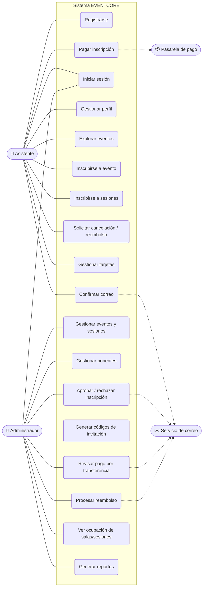

# EVENTCORE — Modelo de datos y casos de uso (referencia)

> Borrador de trabajo para el manual técnico. Renderiza en GitHub y en VS Code
> (extensión *Markdown Preview Mermaid Support*). Editalo: es tu punto de partida,
> no la respuesta final.

---

## 1. Diagrama Entidad-Relación (Mermaid `erDiagram`)

```mermaid
erDiagram
    USUARIO ||--o{ EVENTO : "crea (admin)"
    USUARIO ||--o{ INSCRIPCION : "realiza (asistente)"
    USUARIO ||--o{ TARJETA : "registra"
    USUARIO ||--o{ NOTIFICACION : "recibe"
    USUARIO ||--o{ LOG_ACTIVIDAD : "genera"
    USUARIO |o--o{ CODIGO_INVITACION : "usa"

    EVENTO ||--o{ SESION : "contiene"
    EVENTO ||--o{ INSCRIPCION : "recibe"
    EVENTO ||--o{ CODIGO_INVITACION : "emite"

    PONENTE ||--o{ SESION : "imparte"
    SALA   ||--o{ SESION : "alberga"
    SESION ||--o{ MATERIAL_RECURSO : "tiene"
    SESION ||--o{ INSCRIPCION_SESION : "registra"

    TIPO_ENTRADA ||--o{ INSCRIPCION : "clasifica"

    INSCRIPCION ||--o{ INSCRIPCION_SESION : "incluye"
    INSCRIPCION ||--o{ PAGO : "genera"
    INSCRIPCION ||--o{ SOLICITUD_CANCELACION : "puede tener"

    TARJETA ||--o{ PAGO : "se usa en"

    USUARIO {
        int      id_usuario PK
        string   nombre_completo
        string   correo "UNIQUE"
        string   contrasena_hash
        string   telefono
        string   organizacion
        string   cargo "NULL"
        string   pais_residencia
        string   foto_perfil
        string   rol "ADMIN | ASISTENTE"
        bit      correo_confirmado
        string   token_confirmacion "NULL"
        datetime fecha_registro
        string   estado
    }

    PONENTE {
        int    id_ponente PK
        string nombre_completo
        string correo_contacto
        string fotografia
        string biografia
        string area_especializacion
        string organizacion "NULL"
        string web_redes "NULL"
        bit    activo
    }

    SALA {
        int    id_sala PK
        string nombre
        string ubicacion
        int    capacidad
    }

    EVENTO {
        int      id_evento PK
        int      id_admin FK
        string   nombre
        string   descripcion
        datetime fecha_inicio
        datetime fecha_fin
        string   modalidad "PRESENCIAL | VIRTUAL | HIBRIDA"
        string   ubicacion "NULL"
        string   enlace_transmision "NULL"
        string   categoria "ACADEMICO | CORPORATIVO | CULTURAL | TECNOLOGICO | OTRO"
        string   imagen_banner
        int      capacidad_maxima
        string   estado "BORRADOR | PUBLICADO | CANCELADO | FINALIZADO"
        string   modalidad_inscripcion "ABIERTA | APROBACION | INVITACION"
        bit      es_pago
    }

    SESION {
        int      id_sesion PK
        int      id_evento FK
        int      id_ponente FK
        int      id_sala FK "NULL si virtual"
        string   titulo
        string   enlace "NULL si presencial"
        datetime fecha_hora_inicio
        datetime fecha_hora_fin
        int      cupo_maximo
    }

    MATERIAL_RECURSO {
        int    id_material PK
        int    id_sesion FK
        string nombre
        string url_archivo
    }

    TIPO_ENTRADA {
        int     id_tipo_entrada PK
        string  nombre "EARLY_BIRD | GENERAL | ESTUDIANTE | SESION_INDIVIDUAL | VIP"
        string  descripcion
        decimal tarifa
        string  regla_disponibilidad
    }

    INSCRIPCION {
        int      id_inscripcion PK
        int      id_asistente FK
        int      id_evento FK
        int      id_tipo_entrada FK
        datetime fecha_inscripcion
        string   estado "PENDIENTE | APROBADA | RECHAZADA | CONFIRMADA | CANCELADA"
        decimal  monto
    }

    INSCRIPCION_SESION {
        int      id_inscripcion_sesion PK
        int      id_inscripcion FK
        int      id_sesion FK
        datetime fecha_registro
    }

    CODIGO_INVITACION {
        int      id_codigo PK
        int      id_evento FK
        int      id_asistente FK "NULL hasta usarse"
        string   codigo "UNIQUE"
        string   correo_destinatario
        bit      usado
        datetime fecha_envio
    }

    TARJETA {
        int    id_tarjeta PK
        int    id_asistente FK
        string titular
        string numero_enmascarado
        string tipo "DEBITO | CREDITO"
        string fecha_expiracion
    }

    PAGO {
        int      id_pago PK
        int      id_inscripcion FK
        int      id_tarjeta FK "NULL si transferencia"
        int      id_admin_revisor FK "NULL"
        decimal  monto
        string   metodo "TARJETA | TRANSFERENCIA"
        string   estado "PENDIENTE | CONFIRMADO | RECHAZADO"
        datetime fecha
        string   comprobante_url "NULL"
    }

    SOLICITUD_CANCELACION {
        int      id_solicitud PK
        int      id_inscripcion FK
        int      id_admin_procesador FK "NULL"
        datetime fecha_solicitud
        string   estado "PENDIENTE | PROCESADA | RECHAZADA"
        decimal  monto_reembolso
        string   comprobante_pdf_url "NULL"
        datetime fecha_procesado "NULL"
    }

    NOTIFICACION {
        int      id_notificacion PK
        int      id_usuario FK
        string   tipo
        string   mensaje
        datetime fecha
        bit      leida
    }

    LOG_ACTIVIDAD {
        int      id_log PK
        int      id_usuario FK "NULL si sistema"
        string   accion
        string   entidad_afectada
        string   descripcion
        datetime fecha_hora
        string   ip
    }
```

---

## 2. Diagrama de Casos de Uso (Mermaid `flowchart`)

> Mermaid no tiene un diagrama UML de casos de uso nativo, así que se simula con
> un `flowchart`: los actores son nodos a los lados, el recuadro (`subgraph`) es la
> frontera del sistema, y los óvalos (`(...)`) son los casos de uso.

---

## 3. Reglas de negocio a validar (no se ven en el ER, van en lógica/constraints)

| # | Regla | Dónde se implementa |
|---|-------|---------------------|
| 1 | Un asistente no puede tener sesiones con horario traslapado | Validación en backend + posible trigger |
| 2 | Un ponente no puede tener dos sesiones a la misma hora (aún en eventos distintos) | Validación al asignar sesión |
| 3 | Cupo por evento (`capacidad_maxima`) y por sesión (`cupo_maximo`) | Conteo antes de confirmar inscripción |
| 4 | Early Bird = 20% del cupo total, hasta 30 días antes | Lógica de disponibilidad de `TIPO_ENTRADA` |
| 5 | VIP máximo 10 por evento | Conteo por tipo de entrada |
| 6 | Inscripción hasta 24 h antes del evento | Validación de fecha |
| 7 | Cancelación hasta 48 h antes; reembolso 80% | Validación + cálculo `monto_reembolso` |
| 8 | Ponente no se elimina si tiene sesiones confirmadas (solo se desactiva) | `activo = 0` en vez de DELETE |
| 9 | Solo el admin crea/edita/cancela eventos | Autorización por rol |
