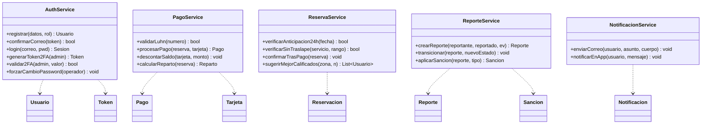

# TRACKFLOW-HUB — Diagrama de clases (referencia)

> Borrador de trabajo para el manual técnico de PT2. Renderiza en GitHub y en VS Code
> (extensión *Markdown Preview Mermaid Support*). Mismo estilo que `modelo-trackflow.md`.

> **ER vs. clases:** el ER (`modelo-trackflow.md` / `trackflow-er.mmd`) es el modelo **físico** de
> tablas. Este es el modelo **orientado a objetos** del dominio: usa **herencia** y **métodos**, y
> separa la **lógica de negocio** en una capa de servicios. Dónde el ER usó una tabla base + perfiles
> y una tabla `Reservaciones` con `Tipo`, aquí se modela con herencia (ver §3).

---

## 1. Modelo de dominio (Mermaid `classDiagram`)

```mermaid
classDiagram
    direction LR

    %% ===================== Enumeraciones =====================
    class RolUsuario {
        <<enumeration>>
        CLIENTE
        OPERADOR
        EMPRESA
        ADMIN
    }
    class EstadoCuenta {
        <<enumeration>>
        ACTIVA
        SUSPENDIDA
        VETADA
    }
    class EstadoSolicitud {
        <<enumeration>>
        PENDIENTE
        ACEPTADA
        RECHAZADA
    }
    class EstadoReserva {
        <<enumeration>>
        ACTIVO
        EN_TRANSITO
        ENTREGADO
        CANCELADO
    }
    class EstadoPago {
        <<enumeration>>
        PENDIENTE
        PROCESADO
        RECHAZADO
    }
    class EstadoReporte {
        <<enumeration>>
        ENVIADO
        EN_REVISION
        ACEPTADO
        RECHAZADO
    }
    class MetodoPago {
        <<enumeration>>
        TARJETA
        WALLET
    }

    %% ===================== Jerarquía de usuarios =====================
    class Usuario {
        <<abstract>>
        +int id
        +string correo
        -string contrasenaHash
        +RolUsuario rol
        +EstadoCuenta estado
        +bool correoConfirmado
        +datetime fechaRegistro
        +iniciarSesion(pwd) bool
        +confirmarCorreo(token) bool
        +editarPerfil(datos) void
    }
    class Cliente {
        +string nombre
        +string apellido
        +string telefono
        +string direccionOrigen
        +buscarServicios(filtros) List~Servicio~
        +programarReserva(servicio, fechas) Reservacion
        +pagar(reserva, tarjeta) Pago
        +calificar(reserva, punt, coment) Calificacion
        +canjearCupon(codigo) CuponCanjeado
        +reportar(reportado, desc) Reporte
    }
    class OperadorLogistico {
        +string nombre
        +string apellido
        +string dpiCui
        +string fotografia
        +EstadoSolicitud estadoRegistro
        +crearServicio(datos) ServicioEnvio
        +suspenderServicio(servicio) void
        +responderComentario(calif, texto) void
        +generarCupon(datos) Cupon
        +reportarCliente(cliente, ev) Reporte
    }
    class EmpresaTransporte {
        +string nombreEmpresa
        +string nit
        +string numeroLicencia
        +EstadoSolicitud estadoRegistro
        +cargarRutasCSV(archivo) List~Ruta~
        +editarRuta(ruta, datos) void
        +cancelarRuta(ruta, motivo) void
        +generarCupon(datos) Cupon
    }
    class Administrador {
        +aprobarOperador(op, decision) void
        +agendarReunion(empresa, fecha, enlace) ReunionVirtual
        +vetarUsuario(usuario, motivo) void
        +resolverReporte(reporte, decision) void
        +aprobarCambioPerfil(solicitud, decision) void
        +registrarAdministrador(datos) Administrador
    }
    Usuario <|-- Cliente
    Usuario <|-- OperadorLogistico
    Usuario <|-- EmpresaTransporte
    Usuario <|-- Administrador

    %% ===================== Servicios ofrecidos =====================
    class ServicioEnvio {
        +int id
        +Zona zonaCobertura
        +decimal capacidadCargaKg
        +decimal precioEnvio
        +bool suspendido
        +bool activo
    }
    class FotoServicio {
        +int id
        +string url
    }
    class Ruta {
        +int id
        +Zona origen
        +Zona destino
        +string tipoServicio
        +time horaInicio
        +int tiempoEstimadoMin
        +decimal precio
        +string estado
    }
    class Vehiculo {
        +int id
        +string identificador
        +string tipo
        +decimal capacidad
    }
    class Zona {
        +int id
        +string nombre
        +string tipo
    }

    OperadorLogistico "1" --> "0..*" ServicioEnvio : ofrece
    ServicioEnvio "1" *-- "3..*" FotoServicio : contiene
    EmpresaTransporte "1" --> "0..*" Ruta : ofrece
    EmpresaTransporte "1" --> "0..*" Vehiculo : registra
    ServicioEnvio "0..*" --> "1" Zona
    Ruta "0..*" --> "2" Zona

    %% ===================== Carrito, reservas y pagos =====================
    class Carrito {
        +int id
        +List~ItemCarrito~ items
        +agregar(item) void
        +eliminar(item) void
        +total() decimal
    }
    class ItemCarrito {
        +int id
        +datetime fechaProgramada
        +decimal monto
    }
    class Reservacion {
        <<abstract>>
        +int id
        +datetime fechaInicio
        +EstadoReserva estado
        +decimal monto
        +cancelar() void
    }
    class ReservaEnvio {
        +datetime fechaFin
    }
    class ReservaTransporte {
        +time hora
    }
    class Tarjeta {
        +int id
        +string titular
        +string numeroEnmascarado
        +string fechaVencimiento
        +decimal saldo
        +MetodoPago metodo
        +bool activo
    }
    class Pago {
        +int id
        +decimal monto
        +EstadoPago estado
        +datetime fecha
    }
    Reservacion <|-- ReservaEnvio
    Reservacion <|-- ReservaTransporte
    Cliente "1" --> "1" Carrito : tiene
    Carrito "1" *-- "0..*" ItemCarrito : contiene
    Cliente "1" --> "0..*" Reservacion : realiza
    Cliente "1" --> "0..*" Tarjeta : registra
    ReservaEnvio "0..*" --> "1" ServicioEnvio
    ReservaTransporte "0..*" --> "1" Ruta
    Reservacion "1" *-- "0..*" Pago : genera
    Pago "0..*" --> "1" Tarjeta : usa

    %% ===================== Interacción posterior =====================
    class Calificacion {
        +int id
        +int puntuacion
        +string comentario
        +string respuestaProveedor
        +datetime fecha
    }
    class Cupon {
        +int id
        +string codigo
        +string tipoDescuento
        +decimal valorDescuento
        +datetime fechaInicio
        +datetime fechaFin
        +bool activo
        +esValido(fecha) bool
    }
    class CuponCanjeado {
        +int id
        +datetime fechaCanje
    }
    class Reporte {
        +int id
        +string tipo
        +string descripcion
        +EstadoReporte estado
        +datetime fecha
    }
    class EvidenciaReporte {
        +int id
        +string url
        +string tipo
    }
    class Sancion {
        +int id
        +string tipo
        +string motivo
        +datetime fechaInicio
        +datetime fechaFin
    }
    Reservacion "1" --> "0..1" Calificacion : recibe
    Usuario "1" --> "0..*" Cupon : emite
    Cupon "1" --> "0..*" CuponCanjeado
    Cliente "1" --> "0..*" CuponCanjeado : canjea
    Usuario "1" --> "0..*" Reporte : reporta
    Usuario "1" --> "0..*" Reporte : es reportado
    Reporte "1" *-- "0..*" EvidenciaReporte : adjunta
    Reporte "1" --> "0..1" Sancion : deriva en
    Administrador "1" --> "0..*" Sancion : aplica

    %% ===================== Soporte (auth / proceso / aviso) =====================
    class Token {
        +int id
        +string tipo
        +string valor
        +datetime fechaExpira
        +bool usado
        +estaVigente() bool
    }
    class SolicitudCambioPerfil {
        +int id
        +string datosPropuestos
        +EstadoSolicitud estado
        +datetime fecha
    }
    class ReunionVirtual {
        +int id
        +datetime fechaHora
        +string enlace
        +string estado
    }
    class Notificacion {
        +int id
        +string tipo
        +string mensaje
        +bool leida
        +datetime fecha
    }
    Usuario "1" --> "0..*" Token : genera
    Usuario "1" --> "0..*" Notificacion : recibe
    Usuario "1" --> "0..*" SolicitudCambioPerfil : solicita
    Administrador "1" --> "0..*" SolicitudCambioPerfil : resuelve
    EmpresaTransporte "1" --> "0..*" ReunionVirtual : participa
```

---

## 2. Capa de servicios (dónde viven las reglas de proceso)

Las reglas que comparan varias filas, la hora actual o porcentajes **no** son atributos de una
entidad: viven en clases de servicio. Esto es lo que en el manual del ER llamamos "lógica del backend".

---

## 3. Notas de diseño (cómo el modelo OOP se mapea a la base)

**Herencia de `Usuario` → tabla base + subtipos.**
En clases, `Cliente`/`OperadorLogistico`/`EmpresaTransporte`/`Administrador` heredan de `Usuario`.
En la base esto se realiza con **una tabla `Usuarios` (lo común) + una tabla de perfil por rol**
(1:1, `UsuarioID` PK y FK). Es el patrón *class-table inheritance*: cada subclase con datos propios
tiene su tabla; el ADMIN no agrega datos, así que no tiene tabla de perfil.

**Herencia de `Reservacion` → una tabla con discriminador.**
`ReservaEnvio` y `ReservaTransporte` heredan de `Reservacion`. En la base se realiza con **una sola
tabla `Reservaciones`** y la columna `Tipo` (ENVIO/TRANSPORTE) como **discriminador**, más dos FKs
opcionales (`ServicioEnvioID`/`RutaID`). Es *single-table inheritance*: menos joins y una sola vista
de "servicios contratados". El `CHECK` de coherencia garantiza que el subtipo y su FK concuerden.

**Composición vs. asociación.**
- **Composición (`*--`)**: la parte no vive sin el todo → `ServicioEnvio` ◆—— `FotoServicio`,
  `Reporte` ◆—— `EvidenciaReporte`, `Carrito` ◆—— `ItemCarrito`, `Reservacion` ◆—— `Pago`.
  En la base, las composiciones más fuertes llevan `ON DELETE CASCADE` (fotos, evidencias).
- **Asociación (`-->`)**: ambos existen por separado → `Cliente` realiza `Reservacion`, `Pago` usa
  `Tarjeta`. Por eso esas FKs **no** cascadean (borrar un cliente no debe borrar su historial).

**Métodos = casos de uso.**
Cada método mapea a un caso de uso del enunciado (`programarReserva`, `aprobarOperador`,
`canjearCupon`…). Las reglas de proceso (Luhn, 24 h, no-traslape, reparto 80/20 y 90/10, vigencia de
tokens) se concentran en la **capa de servicios** (§2), no en las entidades — igual que en el ER esas
reglas eran "del backend", no del esquema.

**Multiplicidad clave.**
- `ServicioEnvio "1" *-- "3..*" FotoServicio`: el mínimo 3 fotos del enunciado queda explícito.
- `Reservacion "1" --> "0..1" Calificacion`: una reserva se califica a lo sumo una vez (= `UNIQUE` en la base).
- `Ruta "0..*" --> "2" Zona`: cada ruta referencia exactamente dos zonas (origen y destino, distintas).
