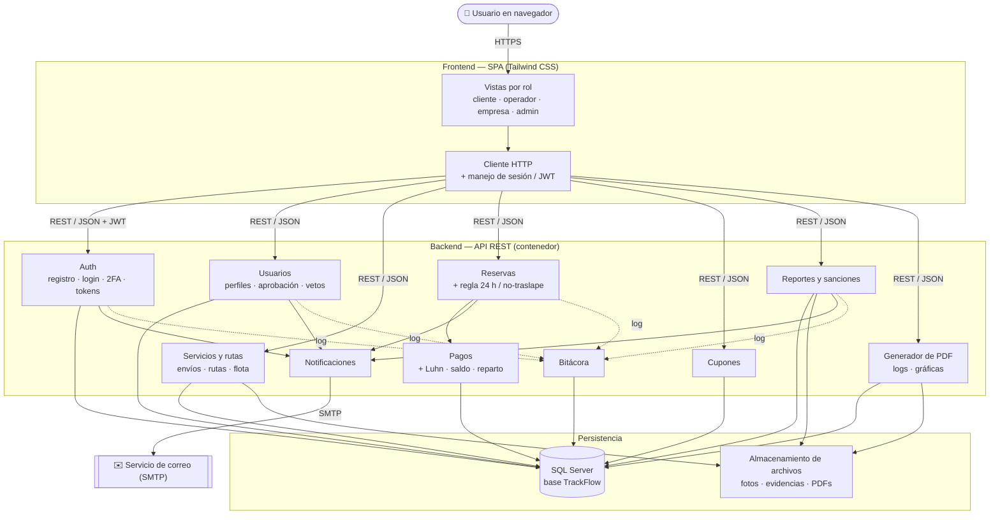

# TRACKFLOW-HUB — Diagrama de componentes (referencia)

> Borrador de trabajo para el manual técnico de PT2. Renderiza en GitHub y en VS Code
> (extensión *Markdown Preview Mermaid Support*). Mismo estilo que los demás `*-trackflow.md`.

> Muestra las **piezas de software** del sistema y cómo se conectan por sus interfaces. El lenguaje y
> framework de frontend/backend son de libre elección (enunciado §9.8); acá se modelan los
> **componentes lógicos** y los **contratos** entre ellos, no una tecnología concreta. El detalle de
> qué tabla toca cada uno está en el ER (`modelo-trackflow.md`) y el DDL (`sql/`).

---

## 1. Diagrama de componentes (Mermaid `flowchart`)

---

## 2. Componentes e interfaces

| Componente | Responsabilidad | Interfaz que ofrece / consume |
|---|---|---|
| **Vistas por rol** (FE) | UI por rol con buenas prácticas UI/UX | Consume la API REST |
| **Cliente HTTP** (FE) | Llamadas a la API, adjunta el JWT | Requiere REST/JSON del backend |
| **Auth** | Registro, login, 2FA del admin, tokens de correo | `POST /registro`, `/login`, `/login/2fa`, `/confirmar` |
| **Usuarios** | Perfiles, aprobación de operador/empresa, vetos, cambios de perfil | `/usuarios`, `/operadores/{id}`, `/perfil` |
| **Servicios y rutas** | Servicios de envío (operador) y rutas/flota (empresa) | `/servicios`, `/rutas`, `/flota` |
| **Reservas** | Carrito, programación, estados; valida 24 h y traslape | `/carrito`, `/reservas` |
| **Pagos** | Procesa el pago, valida Luhn, descuenta saldo, calcula reparto | Consumido por Reservas; usa la BD |
| **Cupones** | Emisión y canje de cupones | `/cupones`, `/cupones/canjear` |
| **Reportes y sanciones** | Denuncias, transición de estados, sanciones/veto | `/reportes`, `/reportes/{id}` |
| **Generador de PDF** | Reportes y gráficas descargables | `/reportes/pdf/...` |
| **Notificaciones** | Avisos en app + correo | Usa el servicio SMTP |
| **Bitácora** | Registra acciones en `LogActividad` | Consumido por los demás componentes |
| **SQL Server** | Persistencia (31 tablas) | Driver de base de datos |
| **Almacenamiento de archivos** | Fotos de servicios, evidencias, PDFs | Sistema de archivos / bucket |
| **Servicio de correo** | Envío de tokens y notificaciones | SMTP (externo) |

---

## 3. Notas de diseño

- **Frontend y backend desacoplados** por una **API REST/JSON** con autenticación **JWT** — el frontend
  es un cliente más; cualquier stack (enunciado: libre elección) puede consumir el mismo contrato.
- **`Pagos` no se expone directo**: lo consume `Reservas`. Así la regla "la reserva se confirma solo si
  el pago fue procesado" queda encapsulada en un solo flujo, no repartida por el frontend.
- **La bitácora es transversal** (flechas punteadas): cada componente la alimenta, pero nadie depende
  de ella para operar; respalda los reportes de logs del admin.
- **El almacenamiento de archivos es aparte de la BD**: la base guarda **URLs/rutas** (no binarios),
  igual que en PT1. Las fotos de servicios, evidencias de reportes y PDFs viven en el sistema de
  archivos / bucket.
- **El servicio de correo es externo** (SMTP): el componente `Notificaciones` es el único que habla con
  él, así el resto del backend no conoce los detalles del proveedor de correo.
