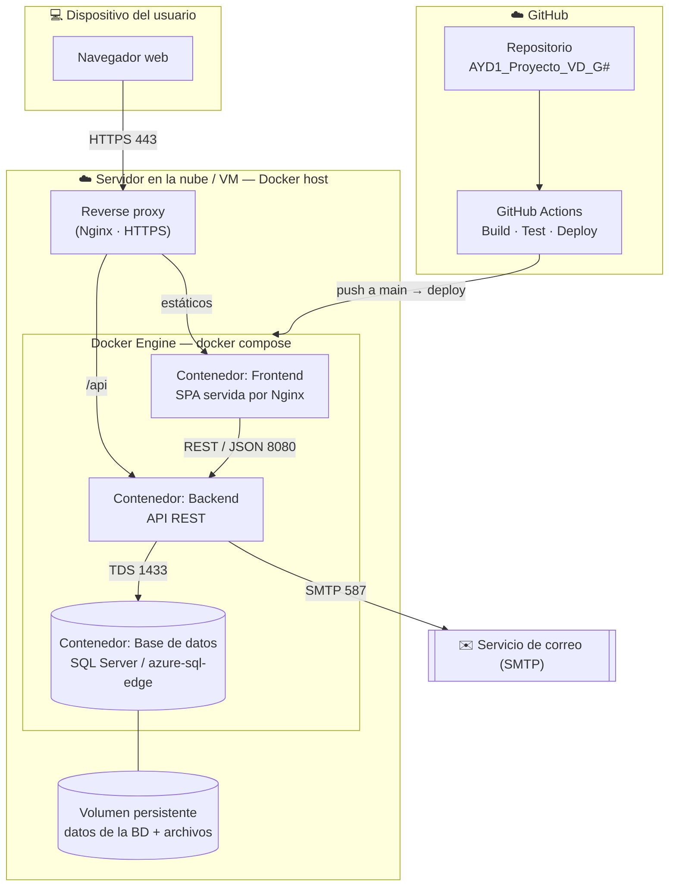

# TRACKFLOW-HUB — Diagrama de despliegue (referencia)

> Borrador de trabajo para el manual técnico de PT2. Renderiza en GitHub y en VS Code
> (extensión *Markdown Preview Mermaid Support*). Mismo estilo que los demás `*-trackflow.md`.

> Muestra **dónde corre** cada pieza: nodos físicos/virtuales, contenedores **Docker** y los
> protocolos/puertos entre ellos. Refleja el enunciado §9.7–9.8: app completa dockerizada (frontend
> y backend) en una VM/servidor en la nube, BD relacional dockerizada o gestionada, y CI/CD en
> **GitHub Actions** que despliega **solo al hacer push a `main`**.

---

## 1. Diagrama de despliegue (Mermaid `flowchart`)

---

## 2. Nodos y artefactos

| Nodo | Qué corre | Notas |
|---|---|---|
| **Dispositivo del usuario** | Navegador | Habla con el servidor solo por **HTTPS** |
| **Reverse proxy (Nginx)** | Termina TLS y enruta `/` → frontend, `/api` → backend | Un solo punto de entrada (443) |
| **Contenedor Frontend** | SPA compilada servida por Nginx | Imagen propia; build en CI |
| **Contenedor Backend** | API REST (lenguaje a libre elección) | Imagen propia; variables de entorno para la conexión a la BD y SMTP |
| **Contenedor Base de datos** | SQL Server / azure-sql-edge | Alternativa: **BD gestionada en la nube** (p. ej. RDS) → se quita este contenedor |
| **Volumen persistente** | Datos de la BD + archivos subidos | Sobrevive a reinicios/recreación de contenedores |
| **GitHub Actions** | Pipeline Build → Test → Deploy | Se dispara **solo en push a `main`** |
| **Servicio de correo** | SMTP externo | Tokens y notificaciones |

---

## 3. Notas de diseño

- **Todo dockerizado y reproducible**: `docker compose` levanta frontend, backend y BD con una sola
  orden; las mismas imágenes corren igual en desarrollo y en producción (consistencia entre entornos,
  enunciado §9.8).
- **La BD: contenedor o gestionada.** Por defecto se dockeriza (volumen persistente para no perder
  datos al recrear el contenedor). Si se usa una BD relacional gestionada en la nube, se elimina el
  contenedor `CDB` y el backend apunta al endpoint gestionado — el resto del despliegue no cambia.
- **CI/CD atado a `main`**: el pipeline de GitHub Actions compila, corre las pruebas unitarias y
  despliega al servidor **únicamente** cuando hay push a `main` (enunciado §9.7). Cada release
  (v1.0.0 → v3.0.0) es un merge a `main` con su tag.
- **Persistencia separada del cómputo**: el volumen guarda datos y archivos; los contenedores son
  reemplazables sin perder estado. Encaja con que la base guarda **rutas** de archivos, no binarios.
- **Un solo punto de entrada TLS**: el reverse proxy expone 443 y enruta a frontend/backend; los
  contenedores internos no se exponen directo a Internet.
