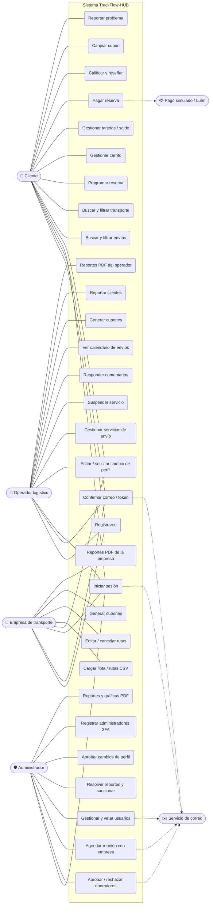

# TRACKFLOW-HUB — Modelo de datos y casos de uso (referencia)

> Borrador de trabajo para el manual técnico de PT2. Renderiza en GitHub y en VS Code
> (extensión *Markdown Preview Mermaid Support*). Es el punto de partida del diseño:
> editalo, no es la respuesta final. Mismo estilo que `../PT1/modelo-eventcore.md`.

---

## 1. Diagrama Entidad-Relación (Mermaid `erDiagram`)

```mermaid
erDiagram
    %% ---------- Identidad y roles ----------
    ROLES        ||--o{ USUARIOS : "clasifica"
    USUARIOS     ||--o| PERFILCLIENTE : "es (CLIENTE)"
    USUARIOS     ||--o| PERFILOPERADOR : "es (OPERADOR)"
    USUARIOS     ||--o| PERFILEMPRESA : "es (EMPRESA)"
    USUARIOS     ||--o{ TOKENS : "genera"
    USUARIOS     ||--o{ NOTIFICACIONES : "recibe"
    USUARIOS     ||--o{ LOG_ACTIVIDAD : "genera"
    USUARIOS     ||--o{ SOLICITUDES_CAMBIO_PERFIL : "solicita"
    USUARIOS     ||--o{ REUNIONES_VIRTUALES : "agenda (empresa↔admin)"
    USUARIOS     ||--o{ SANCIONES : "recibe"

    %% ---------- Catálogos geográficos / enum ----------
    ZONAS        ||--o{ PERFILOPERADOR : "zona de operación"
    ZONAS        ||--o{ SERVICIOS_ENVIO : "zona de cobertura"
    ZONAS        ||--o{ RUTAS : "origen / destino"
    GENEROS      ||--o{ PERFILOPERADOR : "clasifica"

    %% ---------- Operador: servicios de envío ----------
    USUARIOS         ||--o{ SERVICIOS_ENVIO : "ofrece (operador)"
    SERVICIOS_ENVIO  ||--o{ FOTOS_SERVICIO : "tiene (mín 3)"
    SERVICIOS_ENVIO  ||--o{ RESERVACIONES : "se reserva en"

    %% ---------- Empresa: rutas y flota ----------
    USUARIOS  ||--o{ RUTAS : "ofrece (empresa)"
    USUARIOS  ||--o{ FLOTA : "registra (empresa)"
    RUTAS     ||--o{ RESERVACIONES : "se reserva en"

    %% ---------- Cliente: carrito, reservas, pagos ----------
    USUARIOS      ||--o{ ITEMS_CARRITO : "agrega (cliente)"
    USUARIOS      ||--o{ RESERVACIONES : "realiza (cliente)"
    USUARIOS      ||--o{ TARJETAS : "registra (cliente)"
    RESERVACIONES ||--o{ PAGOS : "genera"
    TARJETAS      ||--o{ PAGOS : "se usa en"
    RESERVACIONES ||--o| CALIFICACIONES : "puede recibir"

    %% ---------- Cupones ----------
    USUARIOS  ||--o{ CUPONES : "emite (operador/empresa)"
    CUPONES   ||--o{ CUPONES_CANJEADOS : "se canjea en"
    USUARIOS  ||--o{ CUPONES_CANJEADOS : "canjea (cliente)"
    RESERVACIONES |o--o{ CUPONES_CANJEADOS : "aplica a"

    %% ---------- Reportes y sanciones ----------
    USUARIOS      ||--o{ REPORTES : "reporta / es reportado"
    RESERVACIONES |o--o{ REPORTES : "se reporta"
    REPORTES      ||--o{ EVIDENCIAS_REPORTE : "adjunta"
    REPORTES      ||--o| SANCIONES : "puede derivar en"

    %% ---------- Lookups de estado ----------
    ESTADOS_CUENTA       ||--o{ USUARIOS : "estado de"
    ESTADOS_SOLICITUD    ||--o{ PERFILOPERADOR : "registro"
    ESTADOS_SOLICITUD    ||--o{ PERFILEMPRESA : "registro"
    ESTADOS_SOLICITUD    ||--o{ SOLICITUDES_CAMBIO_PERFIL : "estado"
    ESTADOS_RESERVA      ||--o{ RESERVACIONES : "estado"
    ESTADOS_PAGO         ||--o{ PAGOS : "estado"
    ESTADOS_REPORTE      ||--o{ REPORTES : "estado"

    USUARIOS {
        int      id_usuario PK
        int      id_rol FK
        string   correo "UNIQUE"
        string   contrasena_hash
        bit      correo_confirmado
        int      id_estado_cuenta FK
        string   motivo_veto "NULL"
        bit      requiere_cambio_password "operador con contraseña temporal"
        datetime fecha_registro
    }

    ROLES {
        int    id_rol PK
        string codigo "CLIENTE | OPERADOR | EMPRESA | ADMIN"
    }

    ESTADOS_CUENTA {
        int    id_estado_cuenta PK
        string codigo "ACTIVA | SUSPENDIDA | VETADA"
    }

    PERFILCLIENTE {
        int    id_usuario PK "FK → USUARIOS (1:1)"
        string nombre
        string apellido
        string telefono
        string direccion_origen "predeterminada, NULL"
    }

    PERFILOPERADOR {
        int    id_usuario PK "FK → USUARIOS (1:1)"
        string nombre
        string apellido
        string dpi_cui "UNIQUE"
        string telefono
        string telefono_respaldo "NULL"
        string fotografia
        int    id_zona_operacion FK
        int    id_genero FK
        int    id_estado_solicitud FK "SOLICITADO/ACEPTADO/RECHAZADO"
    }

    PERFILEMPRESA {
        int    id_usuario PK "FK → USUARIOS (1:1)"
        string nombre_empresa
        string telefono
        string telefono_respaldo "NULL"
        string nit "UNIQUE"
        string numero_licencia "UNIQUE"
        int    id_estado_solicitud FK
    }

    GENEROS {
        int    id_genero PK
        string codigo "M | F | OTRO"
    }

    ZONAS {
        int    id_zona PK
        string nombre
        string tipo "NACIONAL | INTERNACIONAL"
    }

    TOKENS {
        int      id_token PK
        int      id_usuario FK
        string   tipo "CONFIRMACION_CORREO | DOBLE_FACTOR_2FA | PASSWORD_TEMPORAL"
        string   valor "6 chars confirmación / token 2FA"
        datetime fecha_expira
        bit      usado
    }

    SOLICITUDES_CAMBIO_PERFIL {
        int      id_solicitud PK
        int      id_usuario FK "operador o empresa"
        string   datos_propuestos "JSON con campos a cambiar"
        int      id_estado_solicitud FK
        int      id_admin_revisor FK "NULL hasta resolver"
        datetime fecha_solicitud
    }

    REUNIONES_VIRTUALES {
        int      id_reunion PK
        int      id_empresa FK
        int      id_admin FK
        datetime fecha_hora
        string   enlace
        string   estado "AGENDADA | REALIZADA | CANCELADA"
    }

    SERVICIOS_ENVIO {
        int     id_servicio PK
        int     id_operador FK
        int     id_zona_cobertura FK
        decimal capacidad_carga_kg
        decimal precio_envio
        string  descripcion
        bit     suspendido "suspensión temporal"
        bit     activo "borrado lógico"
    }

    FOTOS_SERVICIO {
        int    id_foto PK
        int    id_servicio FK
        string url_archivo
    }

    RUTAS {
        int     id_ruta PK
        int     id_empresa FK
        int     id_zona_origen FK
        int     id_zona_destino FK
        string  tipo_servicio
        time    hora_inicio
        int     tiempo_estimado_min
        decimal precio
        string  estado "ACTIVA | SUSPENDIDA | CANCELADA"
    }

    FLOTA {
        int    id_vehiculo PK
        int    id_empresa FK
        string identificador "placa / código"
        string tipo
        decimal capacidad
    }

    ITEMS_CARRITO {
        int      id_item PK
        int      id_cliente FK
        string   tipo "ENVIO | TRANSPORTE"
        int      id_servicio_envio FK "NULL si transporte"
        int      id_ruta FK "NULL si envío"
        datetime fecha_programada
        decimal  monto
    }

    RESERVACIONES {
        int      id_reserva PK
        int      id_cliente FK
        string   tipo "ENVIO | TRANSPORTE"
        int      id_servicio_envio FK "NULL si transporte"
        int      id_ruta FK "NULL si envío"
        datetime fecha_inicio
        datetime fecha_fin "rango para envío"
        int      id_estado_reserva FK
        decimal  monto
        datetime fecha_creacion
    }

    ESTADOS_RESERVA {
        int    id_estado_reserva PK
        string codigo "ACTIVO | EN_TRANSITO | ENTREGADO | CANCELADO"
    }

    TARJETAS {
        int     id_tarjeta PK
        int     id_cliente FK
        string  titular
        string  numero_enmascarado "Luhn validado"
        string  fecha_vencimiento "MM/AAAA"
        decimal saldo "inicial Q1000"
        string  metodo "TARJETA | WALLET"
        bit     activo "borrado lógico"
    }

    PAGOS {
        int      id_pago PK
        int      id_reserva FK
        int      id_tarjeta FK
        decimal  monto
        int      id_estado_pago FK
        datetime fecha
    }

    ESTADOS_PAGO {
        int    id_estado_pago PK
        string codigo "PENDIENTE | PROCESADO | RECHAZADO"
    }

    CALIFICACIONES {
        int      id_calificacion PK
        int      id_reserva FK
        int      id_cliente FK
        int      puntuacion "1-5"
        string   comentario
        string   respuesta_proveedor "NULL hasta responder"
        datetime fecha
    }

    CUPONES {
        int      id_cupon PK
        int      id_emisor FK "operador o empresa"
        string   codigo "UNIQUE"
        string   tipo_descuento "PORCENTAJE | MONTO"
        decimal  valor_descuento
        string   condiciones
        datetime fecha_inicio
        datetime fecha_fin
        bit      activo
    }

    CUPONES_CANJEADOS {
        int      id_canje PK
        int      id_cupon FK
        int      id_cliente FK
        int      id_reserva FK "NULL si solo guardado"
        datetime fecha_canje
    }

    REPORTES {
        int      id_reporte PK
        int      id_reportante FK
        int      id_reportado FK
        int      id_reserva FK "NULL"
        string   tipo "ENVIO | TRANSPORTE | CLIENTE"
        string   descripcion
        int      id_estado_reporte FK
        datetime fecha_reporte
    }

    ESTADOS_REPORTE {
        int    id_estado_reporte PK
        string codigo "ENVIADO | EN_REVISION | ACEPTADO | RECHAZADO"
    }

    EVIDENCIAS_REPORTE {
        int    id_evidencia PK
        int    id_reporte FK
        string url_archivo
        string tipo "FOTO | VIDEO"
    }

    SANCIONES {
        int      id_sancion PK
        int      id_usuario FK "sancionado"
        int      id_reporte FK
        int      id_admin FK "quién sanciona"
        string   tipo "SUSPENSION_TEMPORAL | VETO_PERMANENTE"
        string   motivo
        datetime fecha_inicio
        datetime fecha_fin "NULL si permanente"
    }

    ESTADOS_SOLICITUD {
        int    id_estado_solicitud PK
        string codigo "PENDIENTE | ACEPTADA | RECHAZADA"
    }

    NOTIFICACIONES {
        int      id_notificacion PK
        int      id_usuario FK
        string   tipo
        string   mensaje
        bit      leida
        datetime fecha
    }

    LOG_ACTIVIDAD {
        bigint   id_log PK
        int      id_usuario FK "NULL si sistema"
        string   accion
        string   entidad_afectada
        string   descripcion
        datetime fecha_hora
    }
```

---

## 2. Diagrama de Casos de Uso (Mermaid `flowchart`)

> Como en PT1: los actores son nodos a los lados, el recuadro (`subgraph`) es la frontera del
> sistema, los óvalos `(...)` son casos de uso. Las flechas punteadas van a servicios externos.

---

## 3. Reglas de negocio a validar (no se ven en el ER; van en lógica/constraints)

| # | Regla | Dónde se implementa |
|---|-------|---------------------|
| 1 | Contraseña segura confirmada dos veces en el registro | Validación frontend + backend (la BD guarda solo el hash) |
| 2 | Confirmar correo con token de **6 caracteres** antes de iniciar sesión | `TOKENS` (tipo CONFIRMACION) + flag `correo_confirmado`; valida backend |
| 3 | Operador entra solo si **correo confirmado + aceptado** por admin | `PERFILOPERADOR.id_estado_solicitud` (ACEPTADO) + backend |
| 4 | Operador aceptado recibe **contraseña temporal** y la cambia al primer ingreso | `requiere_cambio_password = 1`; backend fuerza el cambio |
| 5 | Empresa entra tras **reunión virtual aprobada** + credenciales especiales | `REUNIONES_VIRTUALES` + estado solicitud; backend |
| 6 | Admin usa **2FA**: token al correo con vigencia **2 min** | `TOKENS` (tipo 2FA, `fecha_expira = +2 min`); backend |
| 7 | Vetar usuario exige **motivo**; al loguear se le avisa; sin apelaciones | `ESTADOS_CUENTA = VETADA` + `motivo_veto`; backend bloquea login |
| 8 | Servicio de envío requiere **mínimo 3 fotos** | Conteo de `FOTOS_SERVICIO` antes de publicar → backend |
| 9 | "Suspender temporalmente" oculta el servicio sin borrarlo | `SERVICIOS_ENVIO.suspendido = 1` (no DELETE) |
| 10 | Cambios de perfil de operador/empresa requieren **aprobación del admin** | `SOLICITUDES_CAMBIO_PERFIL` nace PENDIENTE; admin la mueve |
| 11 | Programar envío con **≥ 24 h** de anticipación y **sin traslape** de fechas | Comparación de fechas y rangos en backend |
| 12 | Reserva se confirma **solo si el pago fue procesado** | `PAGOS.id_estado_pago = PROCESADO` antes de activar la reserva |
| 13 | Número de tarjeta validado con **algoritmo de Luhn manual** | Backend (no es del esquema) |
| 14 | Tarjeta ficticia nace con **saldo Q1000**; las compras descuentan | `TARJETAS.saldo` con DEFAULT 1000; backend descuenta |
| 15 | **Segundo método de pago** simulado (wallet/transferencia) | `TARJETAS.metodo` (TARJETA \| WALLET) |
| 16 | Cancelar reserva hasta **24 h antes**; reembolso a criterio | Validación de fecha en backend |
| 17 | **Carrito persistente** aunque el cliente cierre sesión | `ITEMS_CARRITO` persistido por `id_cliente` |
| 18 | Calificar envío tras la **fecha de entrega**; transporte tras el **trayecto** | Backend valida estado/fecha de la reserva antes de permitir |
| 19 | Sugerir **3 operadores/empresas mejor calificados** según el primer servicio elegido | Consulta de ranking por `AVG(puntuacion)` en backend |
| 20 | Reparto: envío **80/20**, transporte **90/10** | Cálculo en backend a partir de `monto` |
| 21 | Empresa **no puede reportar** a clientes (solo observar reportes) | Autorización por rol en backend |
| 22 | Estados de reporte: Enviado → En revisión → Aceptado/Rechazado | `ESTADOS_REPORTE`; admin transita y aplica `SANCIONES` |
| 23 | Sanciones: desde **suspensión temporal** hasta **veto permanente** | `SANCIONES.tipo` + actualiza `ESTADOS_CUENTA` |
| 24 | Cupones por temporada con condiciones y vigencia | `CUPONES.fecha_inicio/fecha_fin` + `condiciones`; backend valida |
| 25 | El **correo del cliente no se modifica** salvo justificación | Backend lo bloquea en edición de perfil |
| 26 | Reportes del admin **descargables en PDF** (logs y gráficas) | SELECTs + generación de PDF en backend |

---

## 4. Notas de diseño (las preguntas típicas del catedrático)

**¿Por qué tabla base `Usuarios` + perfiles separados, y no una sola tabla como en EventCore?**
En PT1 admin y asistente compartían exactamente los mismos campos → cabían en una tabla con `RolID`.
Acá los 4 roles tienen datos **disjuntos** (un operador tiene DPI, zona y género; una empresa tiene NIT
y licencia; un cliente tiene dirección de origen). Meterlos en una sola tabla la llenaría de columnas
NULL. La solución es **tabla base + subtipos** (`PerfilCliente`/`PerfilOperador`/`PerfilEmpresa`):
`Usuarios` guarda lo común (correo, hash, rol, estado) y cada perfil cuelga 1:1 con su `UsuarioID` como
PK y FK a la vez. El rol sigue dando los permisos.

**¿Por qué una sola tabla `Reservaciones` con dos FKs opcionales y no dos tablas?**
El cliente ve "todos sus servicios contratados con su estado" en **una sola vista** (activo, en tránsito,
entregado, cancelado), y puede contratar envío, transporte o ambos. Una tabla con `TipoReserva` +
`ServicioEnvioID`/`RutaID` (uno NULL según el tipo) hace ese listado un solo SELECT. Es el mismo patrón
de `Pagos` en PT1: **NULL = "no aplica para este tipo", no "falta el dato"**.

**¿Por qué los estados son tablas lookup y no `CHECK IN(...)`?**
Igual que en PT1: los conjuntos que pueden crecer o llevan metadatos van como lookup (estados de
reserva, pago, reporte, solicitud); los enums fijos que nunca cambian (género, método de pago, tipo de
descuento) van como `CHECK`. *Conjunto extensible = lookup; conjunto fijo = CHECK.*

**¿Por qué borrado lógico (`activo`, `suspendido`)?**
Para no romper FKs ni perder historial: un servicio con reservas no se borra, se suspende; una tarjeta
con pagos no se borra, se inactiva. Mismo criterio que `Ponentes`/`Tarjetas` en EventCore.

> Próximos artefactos (cuando los pidas): DDL en SQL Server **tecleado paso a paso** por vos (no pego
> el `.sql` completo), diccionario campo por campo, y los diagramas de clases/secuencia del entregable.
