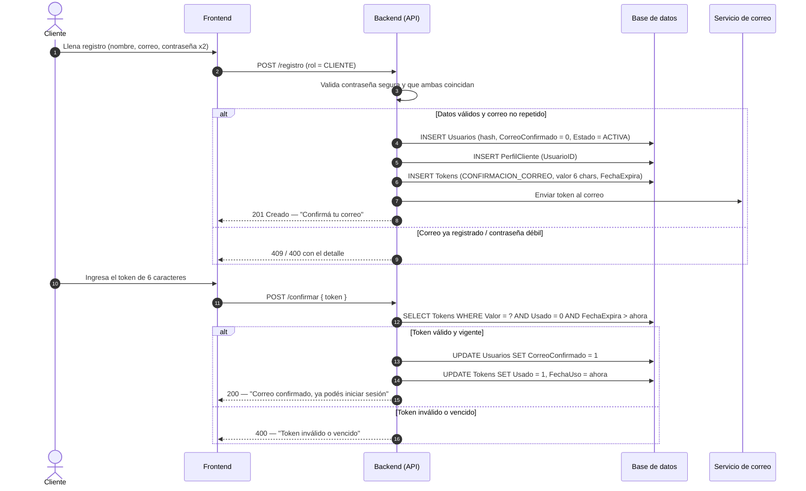
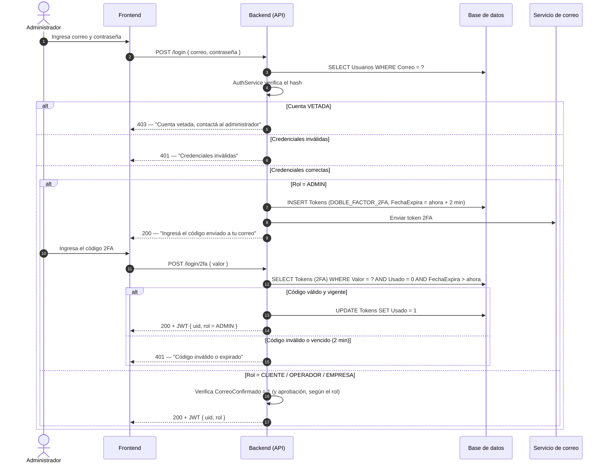
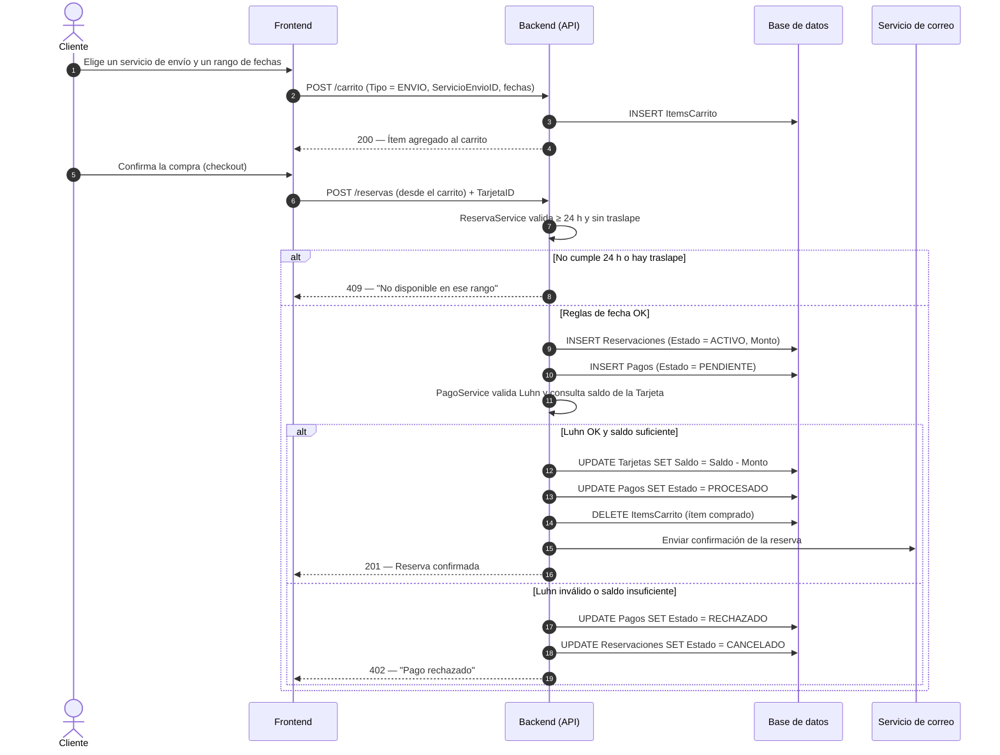
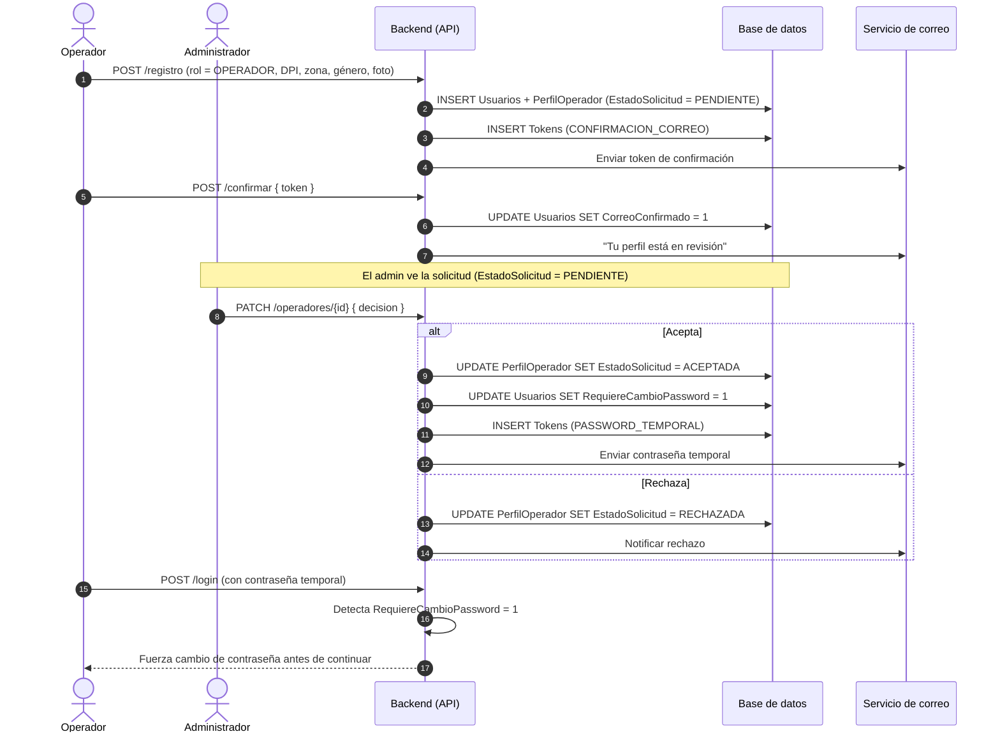
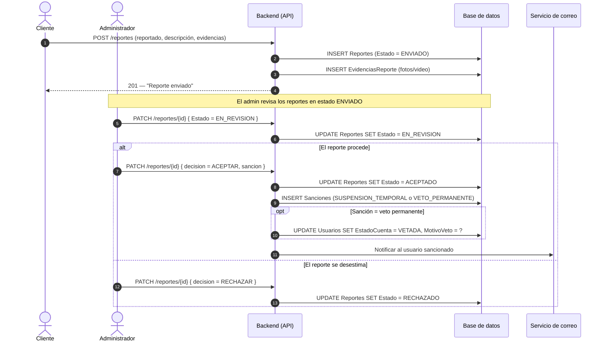

# TRACKFLOW-HUB — Diagramas de secuencia (flujos críticos)

> Borrador de trabajo para el manual técnico de PT2. Renderiza en GitHub y en VS Code
> (extensión *Markdown Preview Mermaid Support*). Mismo estilo que `modelo-trackflow.md`
> y `clases-trackflow.md`.

> Cada secuencia muestra cómo colaboran las capas en el tiempo: el **actor** (rol), el **Frontend**,
> el **Backend (API)** con sus servicios (`AuthService`, `PagoService`, `ReservaService` de
> `clases-trackflow.md`), la **Base de datos** y el **Servicio de correo**. Las tablas y estados que
> se tocan son los del DDL (`sql/`) y el ER.

Flujos incluidos:
1. [Registro de cliente + confirmación de correo](#1-registro-de-cliente--confirmación-de-correo) → `trackflow-seq-01-registro.mmd`
2. [Login con doble factor (2FA) del administrador](#2-login-con-doble-factor-2fa-del-administrador) → `trackflow-seq-02-login2fa.mmd`
3. [Programar reserva + pago](#3-programar-reserva--pago) → `trackflow-seq-03-reserva-pago.mmd`
4. [Registro y aprobación de operador logístico](#4-registro-y-aprobación-de-operador-logístico)
5. [Reporte de un cliente y resolución del administrador](#5-reporte-y-resolución-del-administrador)

---

## 1. Registro de cliente + confirmación de correo

> Tablas: `Usuarios`, `PerfilCliente`, `Tokens` (tipo `CONFIRMACION_CORREO`, 6 caracteres).
> El login queda bloqueado hasta que `Usuarios.CorreoConfirmado = 1`.

---

## 2. Login con doble factor (2FA) del administrador

> El admin tiene 2FA: tras validar la contraseña se le envía un `Token` (tipo `DOBLE_FACTOR_2FA`)
> con vigencia de **2 minutos**. Los demás roles entran directo si el correo está confirmado y la
> cuenta no está vetada.

---

## 3. Programar reserva + pago

> El carrito es persistente (`ItemsCarrito`). `ReservaService` valida las **24 h de anticipación** y
> el **no-traslape** de fechas; `PagoService` valida **Luhn** y descuenta del **saldo** de la tarjeta.
> La reserva solo se confirma (`Reservaciones.Estado = ACTIVO`) cuando el `Pago` llega a `PROCESADO`.

---

## 4. Registro y aprobación de operador logístico

> El operador, además de confirmar correo, necesita ser **aceptado por el admin**. Al aceptarlo se
> genera una **contraseña temporal** (`Tokens` tipo `PASSWORD_TEMPORAL` + `Usuarios.RequiereCambioPassword = 1`)
> que el operador debe cambiar en su primer ingreso. Tablas: `PerfilOperador.EstadoSolicitud`.

---

## 5. Reporte y resolución del administrador

> Estados de `Reportes`: `ENVIADO → EN_REVISION → ACEPTADO | RECHAZADO`. Si procede, el admin crea una
> `Sancion` (suspensión temporal o veto permanente); el veto pone `Usuarios.EstadoCuenta = VETADA` con
> su `MotivoVeto`. Las evidencias van en `EvidenciasReporte`.

---

## Notas de diseño

- **El estado es la bandeja de entrada.** Igual que en PT1: el módulo del admin es un `SELECT … WHERE
  Estado = 'PENDIENTE' / 'ENVIADO'`. No hacen falta colas; el estado por DEFAULT hace que la solicitud
  o el reporte "aparezcan" solos.
- **La reserva nace y se confirma con el pago.** La fila de `Reservaciones` existe antes de pagar; el
  pago no la inserta, le cambia el estado — por eso `Pagos` puede referenciarla (la FK valida
  existencia, el estado valida el momento). Mismo razonamiento que el pago por transferencia de PT1.
- **Las reglas de tiempo/porcentaje viven en los servicios**, no en la base: 24 h, no-traslape, Luhn,
  vigencia de 2 min del 2FA y reparto 80/20–90/10 los resuelve el backend con los datos que la BD
  garantiza (fechas, montos, saldo).
- **Defensa en profundidad:** el backend valida para dar mensajes amables; la base garantiza con
  `CHECK`/`UNIQUE`/`FK` que un dato inválido no entre jamás.
